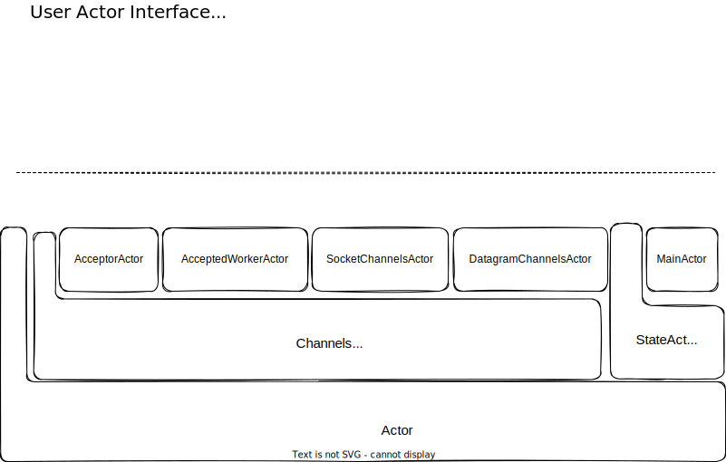
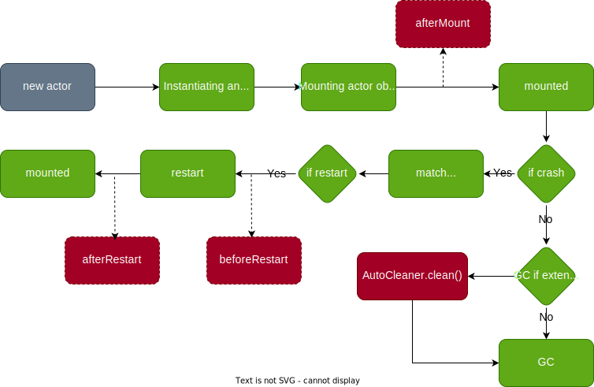

# Actor Model

## Actor Hierarchy

The actor type hierarchy has three main branches:
```json
Actor[+M <: Call]                    (root trait)
  └── AbstractActor[M <: Call]       (engine: FutureDispatcher and message dispatch)
        ├── StateActor[M <: Call]    (pure business logic, no IO)
        │     └── MainActor          (entry point, auto-sends Args notice after mount)
        └── ChannelsActor[M <: Call] (IO-capable actor, manages Channel instances)
              ├── AcceptorActor[W]   (TCP server acceptor)
              ├── AcceptedWorkerActor[M] (handles accepted connections)
              ├── SocketChannelsActor[M]  (TCP client)
              └── DatagramChannelsActor[M] (UDP)
```



## AbstractActor Engine

`AbstractActor` is the central engine that bridges messages to the Stack-based execution model. It extends `FutureDispatcher`, a custom hash table for tracking in-flight promises.

### Receiving Messages

When a message arrives, `ActorHouse.run()` dispatches it to `AbstractActor`:

**Notice** (`receiveNotice`): Extracts the Notice from the Envelope, recycles the Envelope, gets a `NoticeStack` from the object pool, and calls `dispatchNoticeStack`.

**Ask** (`receiveAsk`): Extracts the Ask, gets an `AskStack` from the pool, stores sender address and askId from the Envelope (before recycling it), then calls `dispatchAskStack`.

**Reply** (`receiveReply`): Extracts the Reply and replyId, looks up the corresponding `MessagePromise` in the `FutureDispatcher` hash table, pops it, and calls `handlePromiseCompleted` to resume the suspended Stack.

**Event** (`receiveEvent`): Pattern matches on event type:
- `AskTimeoutEvent` → pops the promise, sets failure with `TimeoutReply`
- `TimeoutEvent` → calls user-defined `handleActorTimeout`
- `ChannelTimeoutEvent` → delegates to channel
- `ReactorEvent` → delegates to `ChannelsActor`

### Mailbox Dispatch Order

`ActorHouse` has five separate mailboxes, processed in strict priority order:

1. **Replies** (replyMailbox) - Always drained first, resumes suspended Stacks
2. **Exceptions** (exceptionMailbox) - Error responses, also release barriers
3. **Asks** (askMailbox) - Only if not in barrier mode
4. **Notices** (noticeMailbox) - Only if not in barrier mode
5. **Events** (eventMailbox) - Always dispatched regardless of barrier state

For `ChannelsActor`, channel pending futures and later tasks are processed after events.

## ActorHouse State Machine

Each Actor is wrapped in an `ActorHouse`, which manages its lifecycle:

CREATED(0) → MOUNTING(1) → WAITING(2) → READY(3) → SCHEDULED(4) → RUNNING(5)

- **CREATED → MOUNTING**: Actor is first created
- **MOUNTING → WAITING**: Actor is mounted, lifecycle properties set
- **WAITING → READY**: A message/event arrives (CAS transition)
- **READY → SCHEDULED**: Pulled from the scheduling queue
- **SCHEDULED → RUNNING**: About to be executed

After `run()` completes, `completeRunning()` transitions to:
- **READY** (re-enqueue) if more messages exist
- **WAITING** if empty (with a race-condition re-check)

### High Priority

An Actor becomes high priority when:
- Reply mailbox has more than 2 messages
- Event mailbox has more than 4 messages
- `stackEndRate` (sent/received ratio) is less than 3 (waiting on many replies)

High-priority actors are placed in a separate sub-queue and always processed before normal-priority actors.

## Barrier Mechanism

When an Ask message is marked as a barrier (`isBarrierCall`), the actor enters `inBarrier` mode. No additional asks or notices are processed until a reply or event clears the barrier. This ensures atomic ordering guarantees.

## Batch Processing

When `batchable == true`, `ActorHouse` collects messages matching `batchAskFilter`/`batchNoticeFilter` into a buffer and dispatches them as a single `BatchAskStack`/`BatchNoticeStack`. Messages not passing the filter are dispatched individually.

## StateActor

`StateActor[M <: Call]` is a pure business-logic actor. It cannot manage Channels (it throws `UnsupportedOperationException` on channel dispatch). Use it for state management, message processing, and timer interactions.

## ChannelsActor

`ChannelsActor[M <: Call]` extends `StateActor` with IO capabilities. It can create channels via `createChannelAndInit()`. It receives `ReactorEvent`s from the thread's `IoHandler` and dispatches them to the appropriate channel.

### AcceptorActor

Server-side actor for accepting TCP connections. On mount:
1. Creates a pool of `AcceptedWorkerActor` instances
2. Binds a `ServerSocketChannel`
3. When a connection is accepted, wraps it in an `AcceptedChannel` message and sends to a worker

### AcceptedWorkerActor

Handles accepted channels from `AcceptorActor`:
1. Receives `AcceptedChannel` Ask
2. Mounts the channel and initializes the pipeline
3. Registers the channel with the thread's `IoHandler`

### SocketChannelsActor

Manages TCP client channels. Use for outbound TCP connections.

### DatagramChannelsActor

Manages UDP channels.

## Actor Lifecycle

The entire lifecycle is managed by the runtime:



### Lifecycle Hooks

- `afterMount()`: Called after the Actor is mounted to the `ActorSystem`. Runtime properties (`logger`, `context`, `address`) are available.
- `beforeRestart()`: Called before restart.
- `restart()`: The restart method itself.
- `afterRestart()`: Called after restart.

### AutoCleanable

If your Actor holds unsafe resources, extend `AutoCleanable` and implement the `cleaner` method. The cleaner creates an `ActorCleaner` that uses JVM phantom references to detect when the Actor is garbage collected and to clean up resources.

**Warning**: The `ActorCleaner` must NOT hold a reference to the Actor or its Address, or the Actor will never be garbage collected.
