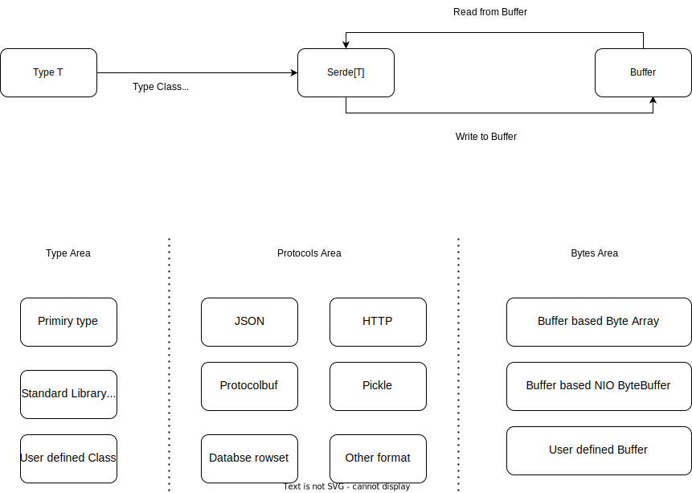

# Serde Framework

`Serde` is a generic serialization and deserialization framework for `otavia` based on `Buffer`. It provides a unified interface for all serialization tools, designed to work efficiently with otavia's buffer management system.



## Design Motivation

Most serialization frameworks in the Scala ecosystem serialize to `java.nio.ByteBuffer` or `Array[Byte]`. This does not work well with `otavia`'s `Buffer` system — it requires an extra memory copy and makes it difficult to leverage memory pools.

`Serde[T]` uses `Buffer` as the serialization target, enabling:
- Zero-copy operation with `AdaptiveBuffer`
- Direct use of memory pools
- Flexible Buffer implementations (heap, direct, file-based)

## Serde Interface

```scala
trait Serde[T] {
  def serialize(output: Buffer, value: T): Unit
  def deserialize(input: Buffer): T
}
```

## Supported Formats

### JSON

JSON serialization/deserialization using the `Serde[?]` interface.

### Protocol Buffers

Protocol Buffers serialization/deserialization with efficient binary encoding directly to/from `Buffer`.

## Integration with Channel Pipeline

Serde integrates naturally with the codec module's `Message2ByteEncoder` and `Byte2MessageDecoder`:

```scala
class MyEncoder(serde: Serde[MyMessage]) extends Message2ByteEncoder[MyMessage] {
  override protected def encode(ctx: ChannelHandlerContext, msg: MyMessage, out: AdaptiveBuffer): Unit = {
    serde.serialize(out, msg)
  }
}

class MyDecoder(serde: Serde[MyMessage]) extends Byte2MessageDecoder[MyMessage] {
  override protected def decode(ctx: ChannelHandlerContext, input: AdaptiveBuffer): MyMessage = {
    serde.deserialize(input)
  }
}
```

This enables zero-copy message serialization in the Channel Pipeline, with data flowing directly between the network and the Actor's message types.
