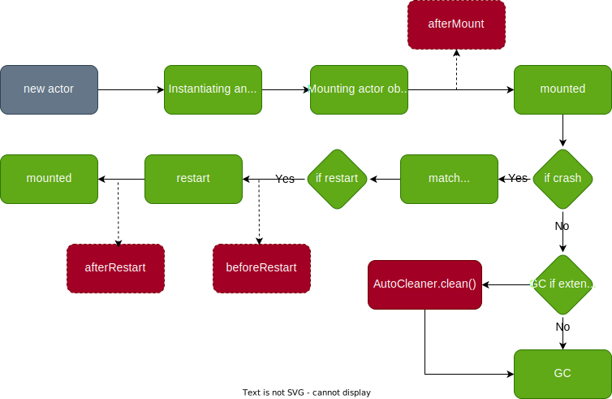

## Environment


`otavia` runs mainly on the JVM platform and currently only supports `Scala 3` for reliable compile-time type safety. If
you are not familiar with `Scala 3`, you can refer to the following information to learn it.

- Basic(enough for `otavia`): [Scala 3 Book](https://docs.scala-lang.org/scala3/book/introduction.html)
- Advance: [Scala 3 Language Reference](https://docs.scala-lang.org/scala3/reference/)

The source code for some of the following examples can be found
at [GitHub - otavia-projects/otavia-examples](https://github.com/otavia-projects/otavia-examples).

## Add dependencies

If you use sbt, add the dependency with
version 

```scala
libraryDependencies += "cc.otavia" %% "otavia-all" % "{version}"
```

If you use mill:

```scala
ivy"cc.otavia::otavia-all:{version}"
```

if maven:

```text
<dependency>
    <groupId>cc.otavia</groupId>
    <artifactId>otavia-all_3</artifactId>
    <version>{version}</version>
</dependency>
```

## Simple Ping-Pong Actors

This simple example defines two `Actors`: `PingActor` and `PongActor`, where `PingActor` receives a `Start` message and
sends a `Ping` message to `PongActor`, and each `Ping` message sent must receive a reply message of type `Pong`.

### Defining Messages

According to the above description, we need 3 types of messages, and these are the 3 basic types of messages
in `otavia`. A `Start` message is a `Notice` message, a `Notice` message is a type of message in `otavia` that does not
need to get a reply, as long as there is an address for the `Actor` you can send a `Notice` message to
the `Actor`. `Ping` is an `Ask` message that must have a reply message associated with it, so if an `Actor` sends it to
another `Actor`, it means it must receive a reply message (kind of like a method parameter in a method definition).
A `Pong` is a reply message, which is a bit like a return value in a method definition.

The `Start` message is of type `Notice`, so it must inherit the `Notice` trait.

```scala
case class Start(sid: Int) extends Notice
```

`Pong` must inherit the `Reply` trait, `Ping` is a message of type `Ask` and must inherit the `Ask` trait, the `Ask`
trait carries a type constraint that describes the type of message for which a reply is expected for this `Ask` message.

```scala
case class Pong(pingId: Int) extends Reply

case class Ping(id: Int) extends Ask[Pong]
```

### Implementing the actor

Once we have our messages, let's define our Actor.

First let's determine the types of messages our `Actor` can receive, since `otavia` is a message-type-safe `Actor`
programming framework, so let's determine the types of messages that each `Actor` can receive: `PingActor`
receives `Start` and `Pong` messages, and `PongActor` receives `Ping` messages and replies to `Pong` messages.
Since reply messages are constrained by `Ask` messages in `otavia`, there is no need to constrain such messages in the
definition of `Actor`, and since `PingActor` needs to send a message to `PongActor`, `PingActor` needs to know the
address of `PongActor`. Roughly, we can define the class name and generic parameters of our Actor as follows:

```scala
final class PongActor() extends StateActor[Ping] {
  // ...
}

final class PingActor(pongActorAddress: Address[Ping]) extends StateActor[Start] {
  // ...
}
```

Here comes `StateActor` which we can ignore for now, the final `Actor` in `otavia` must inherit either `StateActor`
or `ChannelsActor`. The `ChannelsActor` is the `Actor` that handles IO, and all the rest of the `Actors`
are `StateActor`s.

Next, let's implement the methods for processing messages!

First there is the `PingActor` , which has to process the `Start` message and send the `Ping` message during processing,
then wait for the `Pong` message as a reply message, and finally end the processing of the `Start` message.

```scala
final class PingActor(pongActorAddress: Address[Ping]) extends StateActor[Start] {

  override def resumeNotice(stack: NoticeStack[Start]): StackYield = stack.state match {
    case _: StartState =>
      println("PingActor handle Start message")
      println("PingActor send Ping Message")
      val state = FutureState[Pong]()
      pongActorAddress.ask(Ping(stack.notice.sid), state.future)
      stack.suspend(state)  
    case state: FutureState[Pong] =>
      val future = state.future
      if (future.isSuccess) {
        println(s"PingActor received ${future.getNow} message success!")
        assert(future.getNow.pingId == stack.ask.sid)
      }
      stack.`return`()
  }

}
```

`resumeNotice` is the entry point for `Actor` to process `Notice` messages. Any `Notice` messages sent from elsewhere
are passed into the `Actor` through this method. Next we'll implement the `PongActor`. The `PongActor` receives a `Ping`
message and replies with a `Pong` message:

```scala
final class PongActor() extends StateActor[Ping] {
  override def resumeAsk(stack: AskStack[Ping]): StackYield = {
    println(s"PongActor received ${stack.ask} message")
    println(s"PongActor reply ${stack.ask} with Pong message")
    stack.`return`(Pong(stack.ask.id))
  }
}
```

`resumeAsk` is the entry point for `Actor` to process `Ask` messages, and `Ask` messages sent from elsewhere are
passed into `Actor` from this method.

We can see that the `resumeXXX` method of `Actor` does not take messages as arguments directly, but rather loads them
into `Stack`s: `Notice` messages are loaded into `NoticeStack` and `Ask` messages are loaded into `AskStack`. Unlike
most other Actor programming frameworks, sending and receiving messages in `otavia` is tightly managed, which takes away
some of the flexibility but ensures that sending and receiving messages are compile-time type-safe, and makes the
process of sending and receiving messages more akin to method calls. Let's take a look at how we send and receive
messages:

1. Sends a `Notice` message using the `notice` method of `Address`. Calling the `notice` method returns immediately and
   has no return value.
2. Use the `Address`'s `ask` method to send an `Ask` message, and the `ask` method also takes a `Future` as an argument.
   When the `Actor` receives a `Reply` message associated with this `Ask` message, the `Reply` message is placed into
   the `Future` and the state of the `Future` is set to complete.
3. A `Future` can only be associated with one `StackState`, but a `StackState` can be associated with
   multiple `Future`s.
4. A `Stack` can only have one `StackState`. At the end of the `resumeXXX` method, if the return value
   is `Some(StackState)`, set this `StackState` to the latest state of the `Stack` and release the old `StackState` and
   its associated `Future`.
5. When a `Future` completes, the `StackState` checks to see if the associated `Stack` can be executed again by
   the `resumeXXX` method. When the `resumable` method of `StackState` returns `ture` or all associated `Future`s
   reach completion, the associated `Stack` can be executed again.
6. The `StackState` is customizable by the developer and the `resumable` method can be overridden. Of course, `otavia`
   also predefines some common `StackState`s, such as `FutureState` used in the example. `StackState` provides `suspend`
   method to return `StackYield`.
7. When the `Actor` processes a `Notice` message or an `Ask` message, it loads the message into a newly created `Stack`,
   sets the `StackState` of the `Stack` to `StackState.start`, and passes the `Stack` to the `resumeXXX` method to
   begin execution. . `StackState.start` is a special `StackState` of type `StartState` that is not associated with
   any `Future` and whose `resumable` method returns `ture`.
8. The `Stack` uses the `return` method to end processing of the message it is bound to, so the return value of
   the `return` method is `None`. For `AskStack`, the `return` method takes a `Reply` message as an argument to send to
   the sender of the `Ask` message as a reply message to the `Ask` message.

All of the above is compile-time type-safe for sending and receiving messages! A `Stack` can only have one `StackState`,
its initial state is `StartStack`, every time `resumeXXX` completes, it switches to a new `StackState`, and the
last `return` method will return `None`, which means the `Stack` is complete!


Although the message processing may seem complex, most of these steps do not need to be done directly by the developer.
The developer implements the `resumeXXX` method by simply pattern matching the `Stack`'s `StackState` and then
executing the corresponding business logic. If there is a need to wait for some asynchronous messages, a
new `StackState` is returned, otherwise the `return` method is used to end the `Stack`.

At this point, all the `Actors` and messages we need are fully implemented. Next, start an `ActorSystem` to run
these `Actors`.

### Running the actor

```scala
@main def run(): Unit = {
  val system = ActorSystem()
  val pongActor = system.buildActor(() => new PongActor())
  val pingActor = system.buildActor(() => new PingActor(pongActor))

  pingActor.notice(Start(88))
}
```

With `ActorSystem()` we can easily create an `ActorSystem`, which is a runtime container for the actor in `otavia`. A
JVM instance is only allowed to start one `ActorSystem` instance. The `buildActor` method of `ActorSystem` allows us to
instantiate our `Actor`. The `buildActor` method does not return the `Actor` object itself, instead it
returns an `Address` to which we can send messages that the `Actor` can handle.

Everything above is compile-time type-safe; if you send a message to the address returned by `buildActor` that the
corresponding actor can't handle, it won't compile. Same, if you use the `AskStack`'s `return` method to send a `
Reply` message that does not match the corresponding `Ask` message, this will also fail to compile.

## Receive multiple message types

The above example demonstrates an actor that handles one type of message, but in real-world scenarios we often need to
handle multiple types of messages in a single actor. This is very easy in `Scala 3`, and thanks to `Scala 3`'s
powerful `Union Types` and `Intersection Types`, we can also make it compile-time type-safe to handle multiple messages.

Suppose we need to implement an actor that receives a `Hello` message and returns a `World` message, receives a `Ping`
message and returns a `Pong` message, and receives an `Echo` message and returns no message.

The above requirement requires us to define the following kinds of messages:

```scala
case class Echo() extends Notice

case class World() extends Reply

case class Hello() extends Ask[World]

case class Pong() extends Reply

case class Ping() extends Ask[Pong]
```

Then we implement our actor:

```scala
final class MultiMsgActor() extends StateActor[Echo | Hello | Ping] {

  override def resumeNotice(stack: NoticeStack[Echo]): StackYield = {
    println("MultiMsgActor received Echo message")
    stack.`return`()
  }

  override def resumeAsk(stack: AskStack[Hello | Ping]): StackYield = {
    stack match {
      case stack: AskStack[Hello] if stack.ask.isInstanceOf[Hello] => handleHello(stack)
      case stack: AskStack[Ping] if stack.ask.isInstanceOf[Ping] => handlePing(stack)
    }
  }

  private def handleHello(stack: AskStack[Hello]): StackYield = {
    println("MultiMsgActor received Hello message")
    stack.`return`(World())
  }

  private def handlePing(stack: AskStack[Ping]): StackYield = {
    println("MultiMsgActor received Ping message")
    stack.`return`(Pong())
  }
}
```

You might wonder, if a message inherits both `Notice` and `Ask`, will the message end up being processed
by `resumeNotice` or `resumeAsk`? The answer is both. `Otavia` does not determine how a message should be handled
based on the type of message, but by how it is sent. There are `notice` and `ask` methods in `Address`, and messages
sent by the `notice` method are eventually processed by `resumeNotice`, while messages sent by the `ask` method are
processed by `resumeAsk`!

## Timer

The `otavia` runtime includes a powerful timer component, `Timer`, which you can interact with in a number of ways, the
main usage scenarios are described below:

### Handle TimeoutEvent

An `Actor` can register for a timeout trigger task via the `registerActorTimeout` method of `Timer`. When the timeout
condition is reached, the `Timer` generates a `TimeoutEvent` and sends it to the registered `Actor`. The timeout event
is then handled by the `handleActorTimeout` method of the `Actor`.

```scala
final class TickActor() extends StateActor[Nothing] { // [Nothing] if no message need process!

  private var onceTickId: Long = Timer.INVALID_TIMEOUT_REGISTER_ID
  private var periodTickId: Long = Timer.INVALID_TIMEOUT_REGISTER_ID

  override protected def afterMount(): Unit = {
    onceTickId = timer.registerActorTimeout(TimeoutTrigger.DelayTime(1, TimeUnit.SECONDS), self)
    periodTickId = timer.registerActorTimeout(TimeoutTrigger.DelayPeriod(2, 2, TimeUnit.SECONDS, TimeUnit.SECONDS), self)
  }

  override protected def handleActorTimeout(timeoutEvent: TimeoutEvent): Unit = {
    if (timeoutEvent.registerId == periodTickId) {
      println(s"period timeout event triggered at ${LocalDateTime.now()}")
    } else if (timeoutEvent.registerId == onceTickId) {
      println(s"once timeout event triggered at ${LocalDateTime.now()}")
    } else {
      println("Never run this")
    }
  }
}
```

It is important to note that the `timer` method within the `Actor` object must be used after the `Actor` has been
mounted on the `ActorSystem`. Only after the `Actor` has been mounted will runtime-related information be injected into
the `Actor` object. Therefore, you cannot use the `timer` method directly in the constructor of the `Actor` object
because the `Actor` instance has not been mounted to the `ActorSystem` yet, and using the runtime-related methods will
result in a null pointer exception. This is described later in the `Actor` lifecycle.

### Stack Sleep

If we want a `Stack` to wait a certain amount of time before it starts re-executing, we can have `StackState` associated
with a `MessageFuture[TimeoutReply]` , and this `Future` will take the timeout event as a result.
The `MessageFuture[TimeoutReply]` completes only when the timeout event is received.

In the previous example, `PingActor` handles the `Start` message with `FutureState` , which is one of the more common
state classes defined by `otavia`, but you can also customize `StackState` if these don't meet your needs.

Now `FutureState` is not enough for us because it is bound to only one `MessageFuture[Pong]`, now we need to bind not
only `MessageFuture[Pong]` but also `MessageFuture[TimeoutReply]`. `Stack` can be re-executed only when both `Future`s
have completed. Let's define our new `StackState`.

```scala
class PongTimeoutState extends StackState {
  val pongFuture = MessageFuture[Pong]()
  val timeoutFuture = MessageFuture[TimeoutReply]()
}
```

Next, re-implement our `PingActor`

```scala
final class PingActor(pongActorAddress: Address[Ping]) extends StateActor[Start] {
  override def resumeNotice(stack: NoticeStack[Start]): StackYield = stack.state match {
    case _: StartState =>
      println("PingActor handle Start message")
      println("PingActor send Ping Message")
      val state = PongTimeoutState()
      pongActorAddress.ask(Ping(stack.notice.sid), state.pongFuture)
      timer.sleepStack(state.timeoutFuture, 2 * 1000)
      stack.suspend(state)  
    case state: PongTimeoutState =>
      val future = state.pongFuture
      if (future.isSuccess) {
        println(s"PingActor received ${future.getNow} message success!")
        assert(future.getNow.pingId == stack.ask.sid)
      }
      stack.`return`()
  }
}
```

Okay, that's done! Now our `PingActor` needs to receive the `Pong` reply message and also wait 2 seconds for
this `Stack` to be resumed.

### Setting a Timeout for Reply Messages

Sometimes, when we send an `Ask` message, the `Actor` on the other side may take a long time, but we don't want our
requesting `Actor` to wait too long, what do we do in this case? Maybe you've already figured out the answer! We've
talked about this before:
> A `StackState` can be associated with one or more `Future`s , and a `Stack` can only resume execution if
> the `resumable` method of the `StackState` is `ture`, or all associated `Future`s have reached completion.

So we can override the `resumable` method of `StackState`! Now let's redefine our `PongTimeoutState` method.

```scala
class PongTimeoutState extends StackState {
  val pongFuture = MessageFuture[Pong]()
  val timeoutFuture = MessageFuture[TimeoutReply]()

  override def resumable(): Boolean = timeoutFuture.isDone
}
```

Now as soon as `timeoutFuture` completes, then `Stack` can be re-executed. However, when we use `pongFuture` we need to
check for completion with `pongFuture.isDone`. That's one way to do it, but given that this is a relatively common
scenario, `otavia` provides a simpler way. All we need to do is make a small change to our previous implementation
of `PingActor`:

```scala
final class PingActor(pongActorAddress: Address[Ping]) extends StateActor[Start] {
  override def resumeNotice(stack: NoticeStack[Start]): StackYield = stack.state match {
    case _: StartState =>
      println("PingActor handle Start message")
      println("PingActor send Ping Message")
      val state = FutureState()
      pongActorAddress.ask(Ping(stack.notice.sid), state.future, 2 * 1000)
      stack.suspend(state)  
    case state: FutureState[Pong] =>
      val future = state.future
      if (future.isSuccess) {
        println(s"PingActor received ${future.getNow} message success!")
        assert(future.getNow.pingId == stack.ask.sid)
      }
      stack.`return`()
  }
}
```

Notice the difference! The `ask` method comes with a timeout parameter!

```scala
pongActorAddress.ask(Ping(stack.notice.sid), state.future, 2 * 1000) // new 
pongActorAddress.ask(Ping(stack.notice.sid), state.future) // old
```

If the `Pong` message is not received after 2 seconds, then the `Future` will be set to complete, but unlike before, we
can't get the `Pong` message from inside the `Future`, it's already in a failed state,
i.e. `isDone=ture isSuccess=false isFailed= ture`. Since this `StackState` is associated with only one `Future`, and
this `Future` is already in a completed state, this `Stack` can continue to be scheduled for execution.

## LifeCycle of Actor

In `otavia`, the user doesn't have to worry much about managing the life cycle of `Actor`, the `Actor` instance is still
managed by the JVM garbage collection. As long as the `Actor` is no longer referenced by the GC root object, the `Actor`
instance will be automatically reclaimed by the JVM's garbage collection system. There are several hook methods
in `Actor` that can be called during different life cycles, such as

- `afterMount`: Called after the `Actor` instance is mounted to `ActorSystem` **For Actor instances `context` related
  methods are only available after mounting**.
- `beforeRestart`: Called before reboot.
- `restart`: Methods for restarting `Actor` instances.
- `afterRestart`: Called after a reboot.
- `AutoCleanable.cleaner`:  If your implementation of `Actor` needs to clean up some unsafe resources, inherit
  the `AutoCleanable` trait and implement the `cleaner` method.

The following figure shows the complete lifecycle of an `Actor`:



Let's define an `Actor` and look at the various hook methods in the lifecycle:

```scala
case class Start() extends Notice

final class LifeActor extends StateActor[Start] with AutoCleanable {
  override protected def afterMount(): Unit = println("LifeActor: afterMount")

  override protected def beforeRestart(): Unit = println("LifeActor: beforeRestart")

  override protected def restart(): Unit = println("LifeActor: restart")

  override protected def afterRestart(): Unit = println("LifeActor: afterRestart")

  override def cleaner(): ActorCleaner = new ActorCleaner {

    println("creating actor cleaner")

    override protected def clean(): Unit = println("clean actor resource before actor stop")

  }

  // if occurs some error which developer is not catch, this will trigger the actor restart
  // you can also override the noticeExceptionStrategy method to change the strategy
  override def resumeNotice(stack: NoticeStack[Start]): StackYield = {
    println("process message")
    throw new Error("")
  }
}
```

The `afterMount` method is mainly used for dependency injection, which will be explained in more detail later.

## Handling IO

Now we have learned to 1) Define `Actor` 2) Define messages 3) Send a message 4) Receive a message and process
a message 5) Trigger a timeout using `Timer`.

But in real business, we often need to deal with a lot of IO tasks, and IO tasks will block our threads, which is one of
the reasons why our programs are underperforming. At the same time, some new technologies such as epoll, io_uring, etc.
are booming, which allow us to handle IO tasks without blocking. The JVM also provides NIO to support non-blocking IO,
but it's not easy to use NIO because the APIs provided by the JVM, such as `java.nio.ByteBuffer`
and `java.nio.channels.Channel`, are too low-level. It's more common to use Netty to handle IO tasks in the JVM.

Thanks to Netty for providing a powerful IO programming tool for the JVM world! Inspired by Netty, the IO module
in `otavia` is basically ported from `Netty`! Handling IO tasks in `otavia` is very much the same as in Netty, and the
API is basically the same. This also makes it very easy for `otavia` to take advantage of the extensive Netty ecosystem
and port codecs for various network protocols. [View otavia ecosystem](https://github.com/otavia-projects).


`otavia` also uses `Channel` to represent an IO object, such as an open file, a network connection. In `otavia`,
however, the `Channel` must run in a `ChannelsActor`. Also `Channel` contains a `ChannelPipeline` component with
a `ChannelHandler` queue.


In order to better manage different `Channel`s, `otavia` implements several different kinds of `ChannelsActor`, they
are:

- `AcceptorActor`: manages the `Channel` that listens for TCP connections, which needs to instantiate a set
  of `AcceptedWorkerActor`s as working `Actor`s. Normal `Channel`s that are accepted by the listening `Channel` are
  wrapped in a message and sent to one of the `AcceptedWorkerActor`s, and managed by the selected `AcceptedWorkerActor`.
- `AcceptedWorkerActor`: The working `Actor` for the `AcceptorActor`.
- `SocketChannelsActor`: manages the TCP client `Channel`.
- `DatagramChannelsActor`: manages the UDP `Channel`.

You will need to choose a type of `ChannelsActor` to implement depending on your needs. Now, let's start our journey
with a simple file reading example!

### Files IO

Netty only supports network IO, `otavia` supports not only network but also files. Now we're going to implement
an `Actor` that receives a request to read a file and returns the file as a `Seq[String]`.

First, let's define the messages that this `Actor` needs to process and return.

```scala
case class LinesReply(lines: Seq[String]) extends Reply

case class ReadLines() extends Ask[LinesReply]
```

Next we will implement our `Actor`, what is the behavior of this `Actor`? First we need to open the file! So we have
a `Channel` that represents the file, and we send the command to read the file to this `Channel`.

```scala
final class ReadLinesActor(file: File, charset: Charset = StandardCharsets.UTF_8)
  extends ChannelsActor[ReadLines] {

  override protected def initFileChannel(channel: Channel): Unit = ???

  override def resumeAsk(stack: AskStack[ReadLines]): StackYield = {
    stack.state match {
      case _: StartState =>
        stack.suspend(openFile(file, Seq(StandardOpenOption.READ), attrs = Seq.empty))  
      case openState: ChannelFutureState if openState.id == 0 =>
        val linesState = ChannelFutureState(1)
        openState.future.channel.ask(FileReadPlan(-1, -1), linesState.future)
        stack.suspend(linesState)
      case linesState: ChannelFutureState if linesState.id == 1 =>
        stack.`return`(LinesReply(linesState.future.getNow.asInstanceOf[Seq[String]]))
    }
  }
}
```

First we use the `openFile` method to open the file and return a `StackState`, which will be ready to
run when the file is opened. This method is a shortcut provided by the `ChannelsActor`, and we can see from the source
code that it is implemented as:

```scala
// source code from ChannelsActor
final protected def openFile(path: Path, opts: Seq[OpenOption], attrs: Seq[FileAttribute[?]]): StackState = {
  val channel               = createFileChannelAndInit()
  val state                 = ChannelFutureState()
  val future: ChannelFuture = state.future
  channel.open(path, opts, attrs, future)
  state
}
```

Nothing special, it's pretty much the same as the `Stack` we talked about before, except that here the `StackState`
is a `ChannelFutureState` and the associated `Future` is a `ChannelFuture`. This `ChannelFuture` is then passed
to `Channel` using the `channel.open` method. The `open` method is not blocking and returns immediately after it is
called, and if this file is opened, then `Reactor` sends `ChannelsActor` a ` ReactorEvent`, `ChannelsActor` receives the
event and sets the `ChannelFuture` to completion. The `ChannelActor` then checks to see if the `Stack` associated with
it can be re-executed.

Here we also see a `createFileChannelAndInit` method, which we can guess from the name creates a file `Channel` and also
initializes the `Channel`. This method calls the `ChannelsActor.initFileChannel` method to initialize the `Channel`.

Now we can implement our `ReadLinesActor.initFileChannel`. We can see that we passed in a `FileReadPlan` instance after
the file was opened:

```scala
val linesState = ChannelFutureState(1)
openState.future.channel.ask(FileReadPlan(-1, -1), linesState.future)
```

The `ask` method will eventually pass `FileReadPlan` into `ChannelPipeline` via the `write` method of `Channel`.
The `ChannelHandler` inside the `ChannelPipeline` needs to be implemented by us, which is basically the same as in
Netty.

Now let's implement our `ChannelHandler`. What does this `ChannelHandler` need to do? First, we need to be able to
handle the `write` inbound event, and second, we need to handle the `channelRead` outbound event. Then we need to handle
the `channelReadComplete` outbound event when the read is complete, and in the `channelReadComplete` method, we need to
generate the final result message back to our `ReadLinesActor`.

```scala
class ReadLinesHandler(charset: Charset) extends ByteToMessageDecoder {

  private val lines = ArrayBuffer.empty[String]
  private var currentMsgId: Long = -1

  override def write(ctx: ChannelHandlerContext, msg: AnyRef, msgId: Long): Unit = msg match {
    case readPlan: FileReadPlan =>
      ctx.read(readPlan)
      currentMsgId = msgId
    case _ =>
      ctx.write(msg, msgId)
  }

  override protected def decode(ctx: ChannelHandlerContext, input: AdaptiveBuffer): Unit = {
    var continue = true
    while (continue) {
      val length = input.bytesBefore('\n'.toByte) + 1
      if (length > 0) {
        lines.addOne(input.readCharSequence(length, charset).toString)
      } else continue = false
    }
  }

  override def channelReadComplete(ctx: ChannelHandlerContext): Unit = {
    val seq = lines.toSeq
    lines.clear()
    val msgId = currentMsgId
    currentMsgId = -1
    ctx.fireChannelRead(seq, msgId)
  }

}
```

Then we also need to add this `ReadLinesHandler` to the `ChannelPipeline` of our `Channel`, remember
the `initFileChannel` method that we didn't implement in the `ReadLinesActor` before. Now we can finalize this method!

```scala
override protected def initFileChannel(channel: Channel): Unit =
  channel.pipeline.addFirst(new ReadLinesHandler(charset))
```

We can notice that our `write` method has a `msgId` parameter, which is a unique message number within the `Channel`
generated by the `ask` method. Because the `write` method is non-blocking, it does not wait for the underlying IO call
to complete, but instead submits a command to read the data to the `Reactor` via `ChannelHandlerContext.read`. The
actual IO work of reading the data is done by the `Reactor`, and the result is sent to the `ChannelsActor` as
an `Event`. The `ChannelsActor` then dispatches the `Event` to the `Channel`. The `Channel` then propagates a
corresponding outbound event in the `ChannelPipeline` by calling the `channelRead` method. Here we inherit
from `ByteToMessageDecoder`, whose `channelRead` method calls the `decode` method, which is mainly used to convert a
sequence of bytes into the object we need. When the `Reactor` finishes reading the data, it also sends an `Event` to
the `ChannelsActor`, which in turn calls the `channelReadComplete` method to propagate an outbound event in
the `ChannelPipeline`. We need to override the `channelReadComplete` method in our `ReadLinesHandler` to generate the
final result and continue to call the `channelRead` method to propagate the final result in the outbound direction.
Notice that our `fireChannelRead` method also has a `msgId` parameter that will allow the message to eventually find its
way to the `Future` inside our previous `ask` method. Next the story goes back to our `Actor`'s `Stack` dispatch.

Now let's start our program to read a text file!

```scala
@main def start(): Unit = {
  val system = ActorSystem()
  val readLinesActor = system.buildActor(() => new ReadLinesActor("build.sc"))
  system.buildActor(() => new MainActor(Array.empty) {
    override def main0(stack: NoticeStack[MainActor.Args]): StackYield = stack.state match {
      case _: StartState =>
        val state = FutureState[LinesReply]()
        readLinesActor.ask(ReadLines(), state.future)
        stack.suspend(state)  
      case state: FutureState[LinesReply] =>
        for (line <- state.future.getNow.lines) print(line)
        stack.`return`()
    }
  })
}
```

You may be thinking that this is too much trouble, I can just use the java file API to do it in a few lines of code, but
you have to write so much! Well, you have to pay for what you get, and the payoff is that this file IO doesn't block the
current `Actor`'s execution thread! The actual IO reading and writing in `otavia` is done by the `Reactor` component,
whose default transport layer implementation is based on NIO. Since the transport layer is implemented using the SPI
mechanism, we can replace the default NIO transport layer with a higher-performance one based on techniques such as
epoll, kqueue, IOCP, or even io_uring! This doesn't require a single change to the upper level code, as long as you
implement the transport layer module according to the SPI specification, add the JARs to CLASSPATH, and it will take
effect immediately! Implementing this efficient transport layer module is the goal of
the [native-transport](https://github.com/otavia-projects/native-transport) project
in [otavia ecosystem](https://github.com/otavia-projects)! If you are interested, your contributions are warmly
welcomed!

### Network IO

Now we are going to implement an echo server on a TCP network that can use telnet to connect, send data inside the
telnet, and return the data to the telnet as is. Since this is a TCP service, we use `AcceptedWorkerActor`
and `AcceptorActor` to implement it. The classes we implement named `EchoAcceptor` and `EchoWorker`.

First we implement `EchoAcceptor`, this `Actor` manages a `Channel` that listens for connections, accepts the connection
and generates a new `Channel`, and then sends this new `Channel` to the `EchoWorker`. The `EchoWorker` is responsible
for specific tasks.

```scala
final class EchoAcceptor extends AcceptorActor[EchoWorker] {
  override protected def workerNumber: Int = 4

  override protected def workerFactory: AcceptorActor.WorkerFactory[EchoServerWorker] =
    () => new EchoWorker()
}
```

In `EchoAcceptor` we define the `workerFactory` method of how to create an `EchoWorker` and the `workerNumber` method of
how many `EchoWorker` instances to create. The `EchoAcceptor` receives the `ChannelsActor.Bind` message and then creates
a `Channel` and binds it to a port to listen for network connections. A `WorkerNumber` instance of `EchoWorker` is
created to distribute the incoming network connections. Next we define our `EchoWorker`

```scala
final class EchoWorker extends AcceptedWorkerActor[Nothing] {

  override protected def initChannel(channel: Channel): Unit = ???

  override def resumeAsk(stack: AskStack[AcceptedChannel]): StackYield =
    handleAccepted(stack)

  override protected def afterAccepted(channel: ChannelAddress): Unit =
    println(s"EchoWorker accepted ${channel}")
}
```

Notice the `initChannel` method? It's similar to `initFileChannel` in the previous example, but this method is used to
initialize the network `Channel`. We need to define our `ChannelHandler` again and add it to the `ChannelPipeline` via
this method. Now let's implement our `ChannelHandler`.

```scala
final class EchoWorkerHandler extends ByteToMessageDecoder {

  override protected def decode(ctx: ChannelHandlerContext, input: AdaptiveBuffer): Unit =
    if (input.readableBytes > 0) ctx.writeAndFlush(input)

}
```

Now that we have our `EchoWorkerHandler`, let's add it to `ChannelPipeline`:

```scala
override protected def initChannel(channel: Channel): Unit =
  channel.pipeline.addLast(new EchoWorkerHandler())
```

Now that everything is ready, let's start our echo server!

```scala
@main def start(): Unit = {
  val actorSystem = ActorSystem()
  actorSystem.buildActor(() => new MainActor() {
    override def main0(stack: NoticeStack[MainActor.Args]): StackYield = stack.state match {
      case _: StartState =>
        val acceptor = system.buildActor(() => new EchoAcceptor())
        val state = FutureState[BindReply]()
        acceptor.ask(Bind(8080), state.future)
        stack.suspend(state)  
      case state: FutureState[BindReply] =>
        println("echo server bind port 8080 success")
        stack.`return`()
    }
  })
}
```

Just start telnet and connect to the echo server and try it out!

> This example is just a brief introduction to the use of Channel, and does not show the more powerful ways in which
> Channel can interact with the ChannelsActor. You can learn more at
> [Core Concepts and Design](./core_concept.md#channel).

## Global Actor and Dependency Injection

Dependency injection is an effective way to decouple code, and it's also useful for the Actor model. Imagine that
sometimes our `Actor` can receive a fixed type of message, but we have different implementations for different
scenarios. If we use `buildActor` to construct these `Actors`, there is significant code coupling. Whenever the scenario
changes we need to modify this code, which is very inflexible. To solve this problem, `otavia` introduces the idea of
dependency injection. We will use a simple example to demonstrate how dependency injection works in `otavia`.

Let's assume that we need to rely on a service `Actor` in our system, and we know the type of messages it receives and
returns, but this service requires different implementations in different scenarios. The following is the message
definition for our service.

```scala
case class Result1() extends Reply

case class Query1() extends Ask[Result1]

case class Result2() extends Reply

case class Query2() extends Ask[Result2]
```

We can then define a `trait` to constrain the messages that our service `Actor` can receive. This is similar to defining
a service using interfaces in object-oriented, except that in object-oriented you use interfaces to constrain the
methods that can be called and in `otavia` you use interfaces to constrain the messages that can be processed!

```scala
trait QueryService extends Actor[Query1 | Query2]
```

With this `QueryService` interface, the specific service `Actor` we implement needs to inherit from this interface.

```scala
final class QueryServiceImpl() extends StateActor with QueryService {
  override def resumeAsk(stack: AskStack[Query1 | Query2]): StackYield = ??? // impl logic
}

// QueryService in another scenario
final class QueryServiceCase2() extends SocketChannelsActor with QueryService {
  override def resumeAsk(stack: AskStack[Query1 | Query2]): StackYield = ??? // impl logic
}
```

For `Actor`s that rely on `QueryService`, you can use the `autowire` method to
look up the `Address` of an available `QueryService` in the `ActorSystem`.

```scala
case class Start() extends Notice

final class TestActor extends StateActor[Start] {

  private var queryService: Address[MessageOf[QueryService]] = _

  override protected def afterMount(): Unit = queryService = autowire[QueryService]() // compile-time type-safe

  override def resumeNotice(stack: NoticeStack[Start]): StackYield = stack.state match {
    case _: StartState =>
      val state = FutureState[Result1]()
      queryService.ask(Query1(), state.future)
      stack.suspend(state)
    case state: FutureState[?] =>
      val pong = state.future.asInstanceOf[MessageFuture[Result1]].getNow
      stack.`return`()
  }
}
```

Now even if we replace the implementation of `QueryService`, our `TestActor` doesn't have to change at all! How do we
get `autowire[QueryService]()` to find the specific implementation `Actor`, just set it to the global `Actor` when
instantiating the implementation `Actor`.

```scala
system.buildActor(() => new QueryServiceImpl(), global = true)
// or if use the other one
system.buildActor(() => new QueryServiceCase2(), global = true)
```

## Batch Processing Messages

Being able to batch messages is a useful technique for some scenarios. Allowing batching is simple, you just need to
override the `batchable` method of your `Actor` to change its return value to `true`, and then override
the `batchNoticeFilter` or `batchAskFilter` methods to select the messages that will go into the batch schedule.

For the detailed code you can refer
[ConsoleAppender](https://github.com/otavia-projects/otavia/blob/main/log4a/src/cc/otavia/log4a/appender/ConsoleAppender.scala)