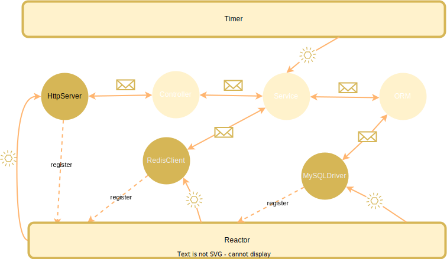
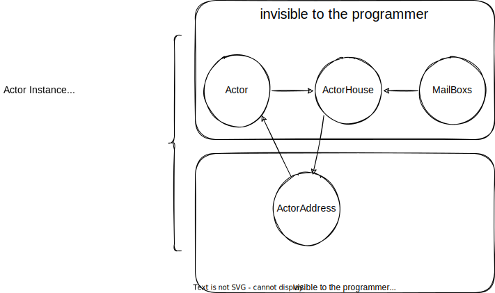
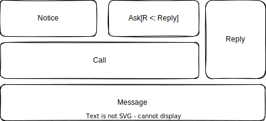
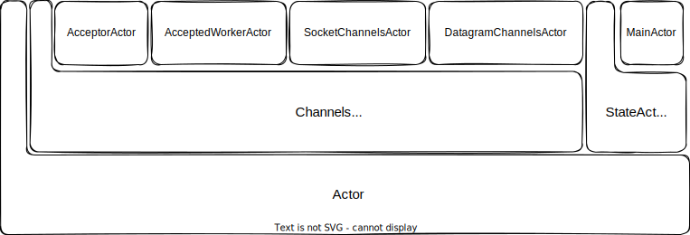
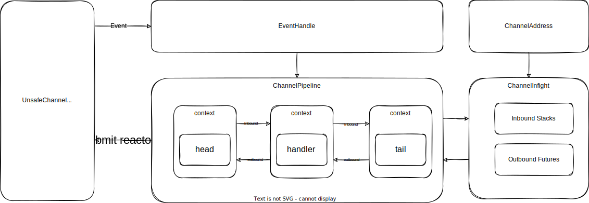
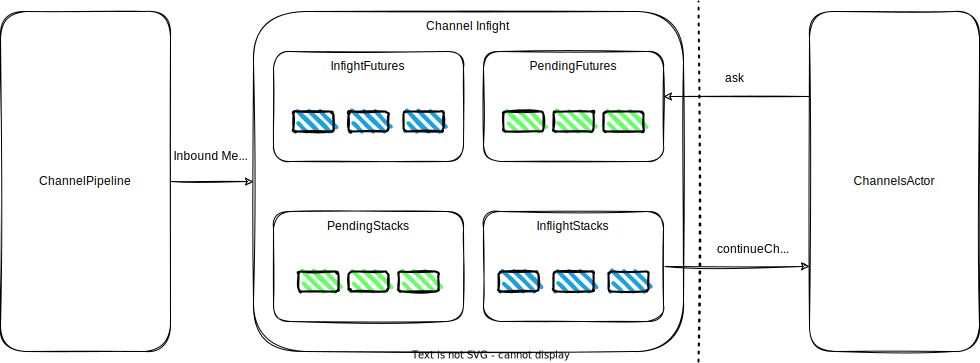
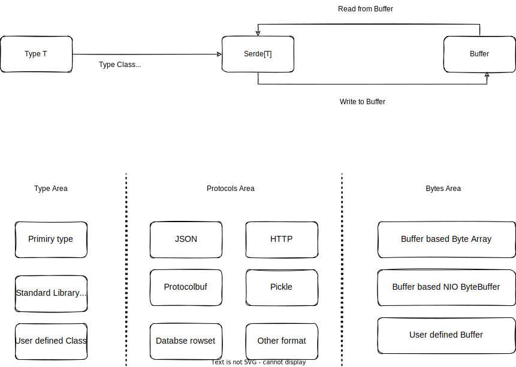

## 现有编程模型的挑战

随着摩尔定律的逐渐失效与现代软件系统规模的疯狂增长，单核 CPU 甚至单机已经不再满足我们的要求了。为了应对这种挑战，现代软件系统不仅
需要在单机上很好的使用多核 CPU，甚至还需要将一个系统分布运行在多台计算机上完成业务。这些挑战严重的冲击着目前的主流编程范式，也让
目前主流编程语言向新的方向进化。

第一是异步编程，但是面向对象编程范式和异步结合的时候往往产生回调地狱，这种方法破坏了面向对象的封装性，而且也让代码逻辑更加分散，
使代码变得不容易维护。

第二是函数式编程变得更加流行，目前基本主流的编程语言都支持部分函数式特性了。函数式编程提出了一个美好的愿景：一切都是不可变的！
这使得编写代码就像定义一个数学函数，一旦函数完成定义，每次调用时只要输入一致那么输出也一致，除此之外不会有任何其余的行为。这种
编程范式是一种很美妙的思想，采用这种方式编写的代码不仅安全而且更加容易测试，代码的行为也更可控。但是函数式也有一些的缺点：
那就是不容易处理状态，而一个现实的软件系统往往需要处理很多状态、IO 等。虽然函数式编程也有 `Monad`、`Effect` 等技术来应对
这些场景，但是这些技术对于很多开发者来说太复杂了，而且学习成本比较高。还记得那句名言么？
> Monad 不过是自函子范畴上的一个幺半群嘛，有啥难以理解的？

与此同时，有一个古老的编程范式似乎更加适合现代这种复杂的高并发分布式的软件系统。那就是1973提出的 Actor 模型。但是 Actor
模型同样也存在一些缺点，或许这也是其并没有像面向对象编程那样大规模流行起来的原因。

`otavia` 是基于 `Scala 3` 实现的一个 Actor 编程模型，并且希望探索出一条 Actor 模型与现代编程语言进行更加有效结合的路径，
也希望探索出一些方法解决传统 Actor 模型的一些缺陷。文章以下内容将概括式的介绍 `otavia` 中的核心概念与设计。

## otavia 的设计哲学

面向对象编程是一种非常有用的编程范式，虽然原始的面向对象思想有点类似于 Actor 模型，即对象等价于 Actor，但是由于直接调用方法
的代价远远小于消息传递，现代主流的编程语言对面向对象的实现都将其退化为了一种代码组织与封装的方式。这在单线程的情况下很美好，
一切都被组织得井井有条。

但是危机发生在多线程多 CPU 核心之后：多线程就像一群野蛮的公牛一样在脆弱的对象丛林里横冲直撞！现在程序的执行路径不在单一，不再被
对象井井有条的管控。相反，你需要仔仔细细关心每一个对象是否会被多个线程同时进入，你需要仔仔细细检查程序的并发安全问题。但是
这并不容易做到。特别是对于一个规模巨大的软件系统，你不知道有多少线程在你的对象丛林里冲撞，所以你需要去人肉模拟每一个线程的运行
路径，追踪他们的运行路径，然后找出哪些对象应该需要处理并发安全问题。想象一下，你要追踪这群丛林里的野蛮公牛，一个一个细致的检查
他们踩到了哪些草丛！天啊，这想一想就让人发疯。这种工作已经让人疲惫不堪了，但是还有更加严重的问题：这些公牛踩到某些草丛的时候会
突然静止！他们被阻塞从而被挂起了，这降低了系统CPU的使用率，而这可能又会导致启动更多的线程，并发竞争越来越严重，直到系统在一个
没有被严格检查的并发问题下崩溃！

值得高兴的是目前已经出现了一些新的技术来解决这些问题。如日中天的技术方案便是协程、JVM 虚拟线程。但是在我们看来，这些技术有效
的缓解了线程被挂起从而导致 CPU 使用率低的问题，但是并发竞争导致必须仔细设计我们的对象的问题并没有得到缓解。

问题变得这么糟糕我们认为主要的原因就是目前主流编程语言和面向对象编程范式缺失了一部分关键的特性！即缺乏对并发进行组织，缺乏对执行
流的组织！而目前并发和执行流是和对象耦合在一起的，这在早期的单线程环境中没有什么问题，但是在多线程多 CPU 环境下，这些问题就
变得非常严重了！

组织并发和执行流，正是 Actor 模型擅长的领域！而 `Scala 3` 的出现，让我们看到了设计出一种更加贴合面向对象思想的 Actor 编程
工具的愿景。于是，在经历了很长一段时间构思之后，我设计了 `otavia` 及其相关工具集。目的是探索一种更加简单、安全的编程范式来应对
当前的挑战。也期望开拓一种新的思路提供给大家来一起推动编程工具的发展！

我们认为一个更加好的编程层级划分体系应该像下面这样，`otavia` 的设计也遵循了这种层级关系

**系统 > 进程 > 线程 > 虚拟线程/有栈协程 > `Actor > 对象 > 函数`**

在这种层级设计中，Actor 是并发的终点，也就是说，Actor 及其之后的部分都应该是单线程运行的！Actor 之间通过发送消息进行通信，多条消息
会在 Actor 的邮箱中一条一条的以单线程的方式被处理。Actor 内部的逻辑您可以选择面向对象也可以选择函数式，甚至像 `Scala` 一样将
他们结合起来！现在，一切又变得简单了，你可以大胆的使用对象而不必担心那群野蛮的公牛了！

`otavia` 是一个非常有趣的项目，项目目前处于孵化阶段。如果您感兴趣，热烈欢迎您的任何贡献！同时我们也非常乐意听见您对项目的建议
或者批评。您的一切意见都最终会帮助我们改进项目的质量！您也可以给项目点赞来鼓励这个项目的贡献者！

- [GitHub - otavia-projects/otavia Your shiny new IO & Actor programming model!](https://github.com/otavia-projects/otavia)
- [GitHub - otavia-projects Ecosystem for otavia project.](https://github.com/otavia-projects)

## 核心运行时

`otavia` 中管理并发的基本单元为 `Actor`, 用户只需要实现各种自定义的 `Actor` 然后通过 `Actor`
之间的消息发送来实现整体的系统功能。但是想要做到理想的 `Actor` 编程模型并不简单，因为真实的编程场景不只是程
序内部组件的交互，还涉及与系统外部的其他组件进行交互，而这又涉及 IO 编程，甚至还涉及定时任务。为了满足这些需求，`otavia` 在
Actor 模型的基础上增加了一些新的组件。构成 `otavia` 运行时的核心组件是：

- `Actor`: `Actor` 是 `otavia` 中并发的基本单元，其有两个基本子类。`Actor` 之间通过发送消息进行通信。`Actor`
  还可以通过 `Event` 的方式与 `ActorSystem` 的其他组件进行交互。`Event` 的种类是固定的，用户不能自定义。
    * `StateActor`：普通 `Actor` 。
    * `ChannelsActor`： 用于处理 IO 的 `Actor` 。
- `ActorSystem`: `Actor` 实例的容器，负责创建 `Actor` 实例、管理 `Actor` 实例的生命周期，和调度 `Actor` 实例的执行。
- `Timer`: 产生定时事件，生成超时 `Event` 并且发送给相关 `Actor`。
- `Reactor`: 处理 `ChannelsActor` 提交的 IO 命令，监听 IO 事件， 处理 IO 读写，并且把 IO 结果以 `Event` 的方式发送
  给 `ChannelsActor`。
- `Address`: `Actor` 实例之间相互隔离，他们之间只能通过 `Address` 发送消息进行通信。
- `Message`: 用于 `Actor` 之间相互通信，有3种基本类型的消息: `Notice`、`Reply`、`Ask[R <: Reply]`，用户定义的消息
  必须继承其中的一种或多种。



使用 `otavia` 编程，用户必须先启动一个 `ActorSystem` 实例，这个实例代表了 `otavia` 的运行时。`ActorSystem` 里面包含了
调度  `Actor` 实例运行的线程池、`Timer` 组件和 `Reactor` 组件。接下来用户只需要使用 `ActorSystem` 启动自己的 `Actor`
实例。`ActorSystem` 会向调用者返回对应 `Actor` 实例的 `Address`。接下来，用户就可以通过这个 `Address` 向 `Actor` 发送
消息了。与面向对象中调用方法不一样的地方是，发送消息并不会直接执行处理消息的逻辑，而是将消息放入 `Actor` 的邮箱中等待处理。
一旦 `Actor` 的邮箱中有可以处理的消息，`ActorSystem` 就会调度一个空闲线程来执行这个 `Actor` 实例。



另一种 `Actor` 实例获得线程执行的条件是收到 `Event`，`Event` 同样也是放入 `Actor` 的邮箱中等待处理。 在 `otavia`
中 `Event` 只能由 `Timer` 和 `Reactor` 产生， 用户编程时只需要关心由 `Timer` 产生的 `TimerEvent`， 处理由 `Reactor`
产生的 `ReactorEvent` 由 `ChannelsActor` 进行了进一步的封装。

## Event

`Event` 是 `Actor` 与 `ActorSystem` 运行时进行交互的基本单元，其种类是固定的，用户不能自定义。`Event` 主要分为两种类型

- `TimerEvent` : 由 `Timer` 产生，用于通知一个超时事件。编程的时候直接会使用到的只有 `TimeoutEvent`, 其余 `TimerEvent`
  用于支持其他超时机制，而且被 `Actor` 进行了封装。
- `ReactorEvent`: 由 `Reactor` 产生，用于通知一个 IO 事件。编程时不用直接处理这种 `Event`, 其被 `ChannelsActor` 进行了封装。

`ActorSystem` 运行时向 `Actor` 实例发送 `Event` 也不会直接调用 `Actor` 实例，而是将 `Event` 放入 `Actor` 实例的邮箱中，然后由
`ActorSystem` 运行时分配空闲的线程调度 `Actor` 实例执行。

## 消息模型

消息是 `Actor` 用来通信的一种特殊对象，建议使用 `case class` 来定义。`otavia` 为了保证消息发送的编译时安全，根据消息的用途对消息的类型
进行了分类



按照消息的用途，`otavia` 将消息分成了两种类型，`Call` 消息是一个请求消息，其用于向 `Actor` 请求一个执行过程，并且期望获得一个返回消息。
`Reply` 就是返回消息。这有点像方法的抽象。我们来看看我们怎么样定义一个方法呢？首先，我们需要给方法起一个名字，然后定义方法的参数，接着
定义方法的返回值类型。在 `otavia` 中 `Call` 代表了方法名和方法参数，`Reply` 代表返回值类型。因为发送消息的代价是大于调用方法的，所以对于
方法返回值为 `Unit` 的情况，在 `otavia` 中将 `Call` 简化为了 `Notice` ，需要返回值的情况特化为了 `Ask[R <: Reply]`
，其中 `Notice` 消息是不需要返回 `Reply` 消息的，就像返回值为 `Unit` 的方法没有实际返回值一样。


`Ask` 是一个带类型参数 `R <: Reply` 的 trait，这个参数用来指定这个 `Ask` 消息期望获取的具体的 `Reply` 消息的类型。所以
`otavia` 中 `Actor` 只需要通过类型参数约束能接收的 `Call` 消息类型就可以做到消息发送的编译时类型安全。`Actor` 的类型参数为：

```scala
trait Actor[+M <: Call] 
```

使用 `otavia` 创建一个 `Actor` 实例的时候，并不会直接返回这个实例对象本身，而是返回代表这个实例对象的 `Address` ，同时这个
`Address` 的类型参数跟 `Actor` 保持一致

```scala
trait Address[-M <: Call]
```

所以我们只能向 `Address` 发送 `Actor` 限定的 `M` 类型的消息。`Reply` 消息通过 `Stack` 的 `return` 方法发送，
而 `Stack` 是跟 `Call` 消息的类型关联的，所以发送 `Reply` 消息也是编译时类型安全的。 后文将会详细介绍 `Stack`。

## Actor

`otavia` 中有两类基本的 `Actor` ，`StateActor` 和 `ChannelsActor`， 用户可以根据自己的需要选择继承其中的一种。


`StateActor`: 普通 `Actor` ， 用户可以实现这种 `Actor` 来管理状态，发送、接收消息。这种 `Actor` 还可以与 `Timer` 进行
交互，用于注册一个超时事件。当超时事件触发的时候，`Timer` 会向 `StateActor` 发送 `TimeoutEvent`， 然后 `ActorSystem` 调度
`StateActor` 执行以处理 `TimeoutEvent`。

`ChannelsActor`：在 `StateActor` 功能的基础之上新增了管理 `Channel` 的功能，`otavia` 中的 `Channel` 从 Netty 移植
而来，也基本跟 Netty 保持一致。但是与 Netty 不同的是，`otavia` 中的 `Channel` 必须跟一个 `ChannelsActor` 绑定，作为
`ChannelsActor` 的一部分进行运行。

为了方便使用，`otavia` 根据不同的场景抽象了以下几种常用的 `Actor`，您可以选择继承其中的一种来实现您的需求：



### Stack

`Stack` 是 `Actor` 中管理消息的执行的载体。当 `Actor` 处理一个 `Call` 类型消息的时候，消息并不是直接传入，而是装入一个
`Stack` 然后再传给 `Actor` 执行。使用 `Address` 的 `notice` 方法发送的 `Notice` 消息最终会装入 `NoticeStack` 执行
`continueNotice` 方法；用 `ask` 方法发送的 `Ask` 消息最终会装入 `AskStack` 执行 `continueAsk` 方法。开发者实现的 `Actor`
需要实现以下方法来处理 `Call` 消息

```scala
protected def continueAsk(stack: AskStack[M & Ask[? <: Reply]]): Option[StackState]

protected def continueNotice(stack: NoticeStack[M & Notice]): Option[StackState]
```

`Stack` 包含一个 `StackState`，其初始值为 `StackState.start`， `continueXXX` 方法的返回值 `Option[StackState]` 代表每次
`continueXXX` 执行完成之后 `Stack` 切换为新的 `StackState`。`Stack` 使用 `return` 方法结束，`return` 方法自身的返回值为
`None`，代表 `Stack` 不再切换新的 `StackState`。如果 `Stack` 是 `AskStack`，`return` 方法需要输入一个 `Reply`
消息作为 `Ask` 消息的回复消息。


一个 `StackState` 必须关联一个或者多个 `Future`，当 `StackState` 的 `resumable` 方法返回值为 `true` 或者关联的所有
`Future` 都为完成状态的时候，会再次调用 `continueXXX` 执行这个 `Stack`。注意这里的 `Future` 并不是 `Scala` 标准库里的
`Future`，`otavia` 实现了一套自己的 `Future/Promise` 系统用来接收异步的消息和触发 `Stack` 的执行。

#### Stack 的种类

不同的消息有不同的 `Stack` 子类

- `NoticeStack`: 用于管理 `notice` 发送的 `Notice` 消息的执行。
- `AskStack`: 用于管理 `ask` 发送的 `Ask` 消息的执行。
- `BatchNoticeStack`: 用于批量执行 `Notice` 消息。
- `batchContinueAsk`: 用于批量执行 `Ask` 消息。
- `ChannelStack`: 用于执行 `Channel` 发送来的请求。

**开发者定义的消息可能同时继承 `Notice` 和 `Ask` trait，其最终是作为 `Notice` 消息处理还是 `Ask` 消息处理，取决于消息发送的方式：
如果使用 `Address` 的 `notice` 方法发送，那么作为 `Notice` 消息处理； 如果被 `ask` 方法发送，那么作为 `Ask` 消息处理。**

#### Future 的种类

`Future` 是用于收取一个异步消息的容器，每当一个 `Future` 完成的时候，就会检查与其关联的 `StackState` 是否满足执行的条件，一旦满足，就会
重新调用 `continueXXX` 方法执行 `Stack`。`Future` 按照用途有如下两类

- `MessageFuture`: 用于获取一个 `Reply` 消息或者超时生成的 `TimeoutReply` 消息。
- `ChannelFuture`: 用于获取一个 `Channel` 执行的结果或者 `Channel` 传来的消息。

#### 零成本抽象

尽管我们使用了 `Stack`、`Future` 等管理消息的执行，但是并不用担心系统发送消息太多导致创造太多额外的对象而对 GC 造成压力。因为这些对象
都是由 `otavia` 运行时创建，并且都是被对象池管理的，能做到最大程度的对象复用。同时，开发者实现的 `StackState` 如果被高频使用也可以使用
对象池。`otavia` 为使用对象池提供了非常简单的方法。你可以参考
[FutureState](https://github.com/otavia-projects/otavia/blob/main/core/src/cc/otavia/core/stack/helper/FutureState.scala)
的实现了解对象池的使用。

#### 使用 Stack 管理消息执行的好处

使用 `Stack` 管理消息的执行，我们可以很好的管理消息之间的依赖关系，而且发送消息更加像直接调用一个对象的方法。更进一步，我们甚至可以
使用 `Scala 3` 的元编程工具实现一套基于 CPS(Continuation Passing Style) 的 `async/await` 语法。而这正是项目
[otavia-async](https://github.com/otavia-projects/otavia-async) 的目标。如果您对这个项目感兴趣，热烈欢迎您的贡献！

### 各种 ChannelsActor

为了更好的对各种不同 `Channel` 的管理，`otavia` 实现了几种不同种类的 `ChannelsActor`，他们分别是：

- `AcceptorActor`: 管理监听 TCP 连接的 `Channel`，其需要实例化一组 `AcceptedWorkerActor` 作为工作 `Actor`,
  对于监听 `Channel` 接受的普通 `Channel` 会包装为消息发送给其中一个 `AcceptedWorkerActor`, 并且由 `AcceptedWorkerActor`
  对接受的 `Channel` 进行管理。
- `AcceptedWorkerActor`: `AcceptorActor` 的工作 `Actor`。
- `SocketChannelsActor`: 管理 TCP 客户端 `Channel`。
- `DatagramChannelsActor`: 管理 UDP `Channel`。

其中所有类型的 `ChannelsActor` 都可以管理文件 `Channel`，如果您只需要使用文件 `Channel`，你可以直接继承 `ChannelsActor`。

### Actor 的生命周期

`Actor` 的整个生命周期都被 `otavia` 运行时管理。当 `ActorSystem` 创建一个 `Actor` 对象之后，会立即给调用者返回这个 `Actor`
对象的 `Address`。与此同时，这个 `Actor` 对象会被放入挂载队列中等待挂载到 `ActorSystem`。只有 `Actor` 对象完成挂载之后，运行时
才会调度 `Actor` 处理邮箱中的 `Message` 或者 `Event`。`Actor` 对象挂载的时候会设置运行时相关属性，所以 `Actor` 内与运行时相关的
属性只能在挂载之后才能使用，比如 `logger` 、`context` 等。`Actor` 提供了一些钩子方法用于在不同的生命周期运行。

- `afterMount`: `Actor` 实例挂载到 `ActorSystem` 之后调用。
- `beforeRestart`: 重启之前调用。
- `restart`: 重启 `Actor` 实例的方法。
- `afterRestart`: 重启之后调用。
- `AutoCleanable.cleaner`: 如果您实现的 `Actor` 需要清理一些不安全的资源，继承 `AutoCleanable` trait 然后实现 `cleaner`
  方法。

虽然 `Actor` 实例的生命周期被 `ActorSystem` 管理，但是其销毁仍然由 JVM 的垃圾回收负责。如果一个 `Actor` 实例不再被任何
GC 根对象引用，就会被 JVM 垃圾回收。如果您的 `Actor` 存在一些不安全资源不能被 JVM 垃圾回收，您可以扩展
`AutoCleanable` 然后实现 `cleaner` 方法。 `cleaner` 方法创建一个自定义的 `ActorCleaner` 对象来清理不安全的资源。
因为 `ActorCleaner` 是依靠 JVM 的幽灵引用来识别将会被垃圾回收的 `Actor`，所以当您实现 `ActorCleaner` 的时候，需要小心保
证其不能持有这个 `Actor` 对象的引用或者这个 `Actor` 的地址，否则这个 `Actor` 将永远不会被垃圾回收。

下图显示了 `Actor` 的完整的生命周期过程：


## Channel

在 `otavia` 中，一个 `Channel` 就代表一个 IO 对象，比如一个打开的文件、一个网络连接等。因为 `Channel` 是从 Netty 移植而来，
所以基本的组件也跟 Netty 差不多，也有 `ChannelPipeline` `ChannelHandler` `ChannelHandlerContext` 等组件，并且工作
方式也跟 Netty 差不多。



但是为了 `Channel` 更好的与 `otavia` 的 `ChannelsActor` 结合，也需要做出一些调整：

1. Netty 的 `Channel` 创建成功后需要注册到 `EventLoop` 上。`EventLoop` 是一个线程，这个线程会监听 IO
   事件，然后调度相关的 `Channel` 进行执行。同样对于 `Channel` 的 outbound 调用，也需要转换成任务提交到 `EventLoop`
   线程上排队执行。`otavia` 中没有 `EventLoop` 这个组件。`otavia` 中的 `Channel` 创建成功后需要挂载到一个 `ChannelsActor`
   上，`ChannelsActor` 会将`Channel` 中的 `UnsafeChannel` 注册到 `Reactor` 上。`Reactor` 会监听相关 `Channel` 的 IO
   事件，然后产生相关的 `ReactorEvent` 发送给挂载的 `ChannelsActor`，`ChannelsActor` 被调度执行的时候会将 `ReactorEvent`
   分配给相关的 `Channel` 执行 inbound 流程。
2. Netty 的 `EventLoop` 不仅监听 IO 事件，而且 IO 事件发生的时候还会调度相关的 `Channel` 进行执行，IO 的监听、IO 数据的读写和
   `ChannelPipeline` 的执行都在同一个 `EventLoop` 线程内。但是 `otavia` 中 IO 的监听、IO 数据的读写由 `Reactor` 负责，
   然后按需生成相关的 `ReactorEvent` 发送给 `ChannelsActor`， 由 `ChannelsActor` 负责调度 `ChannelPipeline` 的执行。
3. Netty 中所有的业务逻辑都必须封装成 `ChannelHandler` 放入 `ChannelPipeline` 中执行，如果一个 inbound 事件到达
   `ChannelPipeline` 尾部 `TailHandler` 仍然没有处理，那么 Netty 会忽略掉这个事件。但是 `otavia` 中 inbound 事件到达
   `TailHandler` 之后会继续传输到到 `Channel` 内的 `Inflight`，然后由 `Inflight` 分发给 `ChannelsActor` 内部的
   `Stack` 处理。事实上，在 `otavia` 中 `ChannelPipeline` 的职责更加集中在字节序列的转换与编解码工作，比如 TLS、压缩、数
   据对象的序列化与反序列化等。其他复杂的业务逻辑直接通过将反序列化的对象传入 `Channel` 的 `Inflight` 组件，然后交给
   `ChannelsActor` 进行进一步的处理。

### Channel 行为的抽象

我们将 `Channel` 的行为通过两种数据结构来进行抽象：一种是
`ChannelFuture`，他是 `Future` 的一个子类，所以他可以被我们之前介绍的 `Stack` 的 `StackState` 管理，这种对象代表
`ChannelsActor` 向 `Channel` 发起一个请求，并期望获取一个 `Channel` 的回复，这种回复可以是一个 IO 就绪事件也可以是一个具体
的消息（比如发送一个 HTTP 请求，使用 `ChannelFuture` 获取 HTTP 回复），对 `ChannelFuture` 的使用方法都限定在
`ChannelAddress` 里面，`ChannelAddress` 是为了更加规范的使用 `Channel` 的一种封装，在 `ChannelsActor` 里面除了部分特殊
的方法可以直接访问 `Channel`，其余访问 `Channel` 的方式只能通过 `ChannelAddress`；另一种数据结构是 `ChannelStack`，这种
对象代表 `Channel` 向我们的 `ChannelsActor` 发起一个请求，这是编写网络服务端程序非常常见的一种场景。比如 `Channel` 收到一个
HTTP 请求，并发送给 `ChannelsActor` 来做具体的业务处理。这个 HTTP 请求会被放入一个 `ChannelStack` 对象发送给
`ChannelsActor` 处理，`ChannelStack` 是一种 `Stack`，其返回值会写入 `ChannelPipeline` 中以响应外部程序。

需要注意的是 Netty 中也有 `ChannelFuture` 这种数据类型，但是他在 Netty 中的使用方式和 `otavia` 中是不同的！Netty 中每次
调用 `Channel` 的 outbound 方法都会关联一个 `ChannelFuture`，但是这个 `ChannelFuture` 是用来获取本次调用本身的结果，
如果想向 `Channel` 发起一个请求并期望获得网络的数据回复，你需要通过其他方式来获取。而 `otavia` 中的 `ChannelFuture` 是
一种更加高级的抽象，其就是代表期望获得的网络请求的回复！

### ChannelPipeline

`ChannelPipeline` 与 Netty 中的 `ChannelPipeline` 基本一致，首尾节点分别是 `HeadHandler` 和 `TailHandler`，当
`Channel` 初始化的时候，用户可以通过 `Channel` 向 `ChannelPipeline` 中添加自定义的 `ChannelHandler`，与 Netty 一样，
`ChannelHandler` 也被 `ChannelHandlerContext` 包裹，然后由 `ChannelHandlerContext` 将所有的 `ChannelHandler` 串
联成一个队列按顺序执行。

`Reactor` 向 `ChannelsActor` 发送来的 `ReactorEvent` 会触发 `ChannelPipeline` 的 inbound 事件，inbound 事件从
`HeadHandler` 向 `TailHandler` 方向传递。调用 `Channel` 的 outbound 相关的方法会触发 outbound 事件从 `TailHandler`
向 `HeadHandler` 方向传递。outbound 事件到达 `HeadHandler` 之后最终会转化为提交到 `Reactor` 的命令。


### Channel Inflight

`Inflight` 并不是一个真实存在组件，其只是 `Channel` 中部分数据结构和机制的代表，用户不需要直接与他们交互，只需要通过
`Channel` 的 `setOption` 方法设置一些属性来控制他们的行为。

```scala
// source code in AbstractChannel
// outbound futures which is write to channel and wait channel reply
private val inflightFutures: QueueMap[ChannelPromise] = new QueueMap[ChannelPromise]()
// outbound futures which is waiting channel to send
private val pendingFutures: QueueMap[ChannelPromise] = new QueueMap[ChannelPromise]()
// inbound stack which is running by actor
private val inflightStacks: QueueMap[ChannelStack[?]] = new QueueMap[ChannelStack[?]]()
// inbound stack to wait actor running
private val pendingStacks: QueueMap[ChannelStack[?]] = new QueueMap[ChannelStack[?]]()
```



`Inflight` 是一种对网络通信数据包发送控制的抽象。我们一般怎么样使用一个网络连接呢？大多数情况是发送一个数据包，然后等待响应
数据包的返回，在响应数据包返回之前，我们不能继续通过这个网络连接发送另外的请求数据包。但是这是一种对网络连接低效的使用方式，
所以有很多应用层协议支持在一个网络连接上连续发送多个请求数据包，比如 HTTP 1.1 中的 pipeline 机制、redis 的 pipeline 机制
等。但是由于这些机制一般实现起来相对复杂，很多应用并没有支持这种优化方式。

但是在 `otavia` 中，强大的 `Inflight` 让实现上述功能变得非常简单！我们已经知道了 `Channel` 中 `ChannelFuture` 和
`ChannelStack` 的用途，那么上述提到的 pipeline 优化就可以简单的理解为一个 `Channel` 同时处理多个 `ChannelFuture` 或
`ChannelStack`。 在 `Channel` 存在以下几种组件来支持这种对网络连接的高效使用：

- `inflightFutures`: 已经进入 `ChannelPipeline` 中处理的 `ChannelFuture`。
- `pendingFutures`: 还在排队等待进入 `ChannelPipeline` 中处理的 `ChannelFuture`。
- `inflightStacks`: 已经进入 `ChannelsActor` 中进行执行的 `ChannelStack`。
- `pendingStacks`: 还在排队等待进入 `ChannelsActor` 中进行执行的 `ChannelStack`。

你可以通过 `setOption` 来控制这些组件的行为来适应不同的网络连接工作方式：

- `CHANNEL_FUTURE_BARRIER`: 用于设置一个 `AnyRef => Boolean` 类型的函数，用来检查一个 `ChannelFuture` 的请求值是否是
  barrier，如果一个请求是 barrier，那么其必须等待 `inflightFutures` 处理完成才能进入 `inflightFutures`，同时
  `inflightFutures` 处理 barrier 的时候只能处理这一个 `ChannelFuture`，处理完成才能继续处理 `pendingFutures` 中的
  `ChannelFuture`。默认值为 `_ => false`。
- `CHANNEL_STACK_BARRIER`: 用于设置一个 `AnyRef => Boolean` 类型的函数，用来检查一个 `ChannelStack` 的请求值是否是
  barrier，如果一个请求是 barrier，那么其必须等待 `inflightStacks` 处理完成才能进入 `inflightStacks`，同时
  `inflightStacks` 处理 barrier 的时候只能处理这一个 `ChannelStack`，处理完成才能继续处理 `pendingStacks` 中的
  `ChannelStack`。默认值为 `_ => true`。
- `CHANNEL_MAX_FUTURE_INFLIGHT`: `inflightFutures` 能同时处理的最大 `ChannelFuture` 的数量，达到最大数量的时候，新的
  `ChannelFuture` 都加入 `pendingFutures` 排队等待进入 `inflightFutures` 。默认值为 1。
- `CHANNEL_MAX_STACK_INFLIGHT`: `inflightStacks` 能同时处理的最大 `ChannelStack` 的数量，达到最大数量的时候，新的
  `ChannelStack` 都加入 `pendingStacks` 排队等待进入 `inflightStacks` 。默认值为 1。
- `CHANNEL_STACK_HEAD_OF_LINE`: 用于设置 `Channel` 处理 `ChannelStack` 是否队头阻塞。当 `inflightStacks`
  同时有多个 `ChannelStack` 进入 `ChannelsActor` 进行调度执行，后发起的 `ChannelStack`
  可能比先发起的 `ChannelStack` 更早完成。当设置成队头阻塞的时候，后完成的不能直接执行后续 `ChannelPipeline` 中的流程，
  而要等待所有先发起调度的 `ChannelStack` 完成之后才能被继续执行。默认值为 `false`。

组合设置这些值将在不同场景中更加正确和高效的使用网络连接资源！

## Reactor

`Reactor` 是 `otavia` 中执行不安全 IO 工作的地方，对于 `otavia` 的用户来说，他是透明的。`Reactor` 负责接收来自
`ChannelsActor` 的 IO 命令，然后产生相关的 `ReactorEvent` 发送给相关的 `ChannelsActor`，不过这一切都被 `ChannelsActor`
进行了封装，大多数用户不用关心 `Reactor`。`Reactor` 具体的工作任务是执行 `ChannelsActor` 提交的 IO 命令，监听 IO 事件，
读写 IO 数据，向 `ChannelsActor` 发送 `ReactorEvent`。

`otavia` 中默认的 `Reactor` 实现是基于 NIO 的，不过因为 `Reactor` 是使用 SPI 机制实现的，所以我们也可以扩展相关接口，
采用 epoll、io_uring 等更先进的 IO 技术来实现一个更加高性能的 `Reactor`。因为采用 SPI 实现，替换另一种 Reactor 实现对于
我们编写的业务代码不会有一点影响，只需要在我们运行程序的时候将相关的 JAR 包含进我们的 CLASSPATH 中。 而基于 epoll、io_uring
实现一个 `Reactor` 正是 [otavia 生态](https://github.com/otavia-projects) 中
[native-transport](https://github.com/otavia-projects/native-transport) 项目的目标！如果你感兴趣，热烈欢迎您的贡献！

## Timer

`otavia` 中所有超时相关的功能都是由 `Timer` 支持的。`Timer` 是 `otavia` 运行时的核心组件之一，他提供了一些 API 可以让开发者注册
一个超时事件触发器，当达到触发器触发条件的时候，生成一个 `TimerEvent` 然后发送给注册的地址。`Timer` 底层的实现从 Netty 中的
`HashedWheelTimer` 移植而来。

## Actor 依赖注入

`Scala 3` 提供了强大的 [Match Types](https://docs.scala-lang.org/scala3/reference/new-types/match-types.html)
机制，这种机制可以让我们很简洁的实现通过 `Actor` 的类型注入 `Actor` 的 `Address`，并且这个行为是编译时类型安全的！

## 生态系统中其他的核心模块

`otavia` 除了核心的运行时之外，还包含了一个广泛的生态。以下只介绍跟核心模块关联比较紧密的部分模块的设计目标。其他模块你可以
[查看 otavia 生态](https://github.com/otavia-projects)。

### CPS 变换

`otavia` 中执行 `Call` 消息需要启动一个 `Stack`，然后整个 `Call` 消息执行的生命周期都由 `Stack` 管理。所以开发者实现
的 `continueXXX` 方法都是需要匹配 `StackState` 然后执行然后返回一个新的 `StackState`。因为模式相对固定，所以我们可以使
用 `Scala 3` 的元编程工具基于 CPS 变换实现一套 `async/await` 语法，这让我们可以使用连续阻塞式的风格编写代码。

项目地址 [GitHub - otavia-projects/otavia-async](https://github.com/otavia-projects/otavia-async)

### Buffer

与 `Channel` 一样，`Buffer` 也是从 Netty 移植而来。因为 `Channel` 需要处理很多字节序列的转换、序列化反序列化工作，所以
`Buffer` API 就是必须的。目前 `Buffer` 只是基本保持 API 与 Netty 一致，其实现以及内存池的实现都被极大的简化了。

另一个与 Netty 比较不一致的是 `otavia` 删除了 `CompositeBuffer`，取而代之的是 `otavia` 引入了 `AdaptiveBuffer` 。

`AdaptiveBuffer` 是一种可以无限扩容并且阅后即焚的 `Buffer`，因为其内部关联了一个 `BufferAllocator`，当空间不够的时候就会分配
一些内存，同时如果数据被读取，那么之前占用的内存也会被释放给 `BufferAllocator`。`AdaptiveBuffer` 是一种在 `Channel` 中重度
使用的数据结构。从 `Reactor` 中接收的 IO 数据会被写入 `AdaptiveBuffer` 在 `ChannelPipeline` 中传递。同时 `Channel`
的 `write` 也会将数据写入 `AdaptiveBuffer` 中，通过 `flush` 方法将 `AdaptiveBuffer` 内部的数据发送给 `Reactor` 写入
IO 对象。

### codec

`codec` 模块提供了一些常用的 `ChannelHandler` 的抽象类，开发者可以根据自己的需求选择继承其中的一种。`otavia` 根据
`ChannelHandler` 处于 `ChannelPipeline` 中的位置和功能对 `ChannelHandler` 进行了一些分类。

- `Byte2ByteXXcoder`: 用于字节序列的转换，输入输出都是字节序列，比如 TLS、压缩等。
- `Byte2MessageDecoder`: 用于对象反序列化，输入是自己序列，输出是对象。
- `Message2ByteEncoder`: 用于对象序列化，输入是对象，输出是字节序列。
- `Message2MessageXXcoder`: 对象转换，输入输出都是对象。

`ChannelPipeline` 中这些类型的 `ChannelHandler` 并不是必须的，开发者可以按照自己的需求组合。


除此之外，`codec` 模块还提供一些工具类和实现完成的 `ChannelHandler`，比如 Base64、压缩等。

### 序列化反序列化框架

`Serde` 期望为所有的序列化与反序列化工具提供一个统一的接口。因为目前 Scala 生态中大多数序列化反序列化框架基本基本都是序列化到
`java.nio.ByteBuffer` 或者 `Array[Byte]`，不能与 `otavia` 的 `Buffer` 高性能的工作在一起（涉及一次数据拷贝，而且不
容易利用内存池）。 所以 `otavia` 引入了 `Serde[T]` 接口，其使用 `Buffer` 作为基本的序列化反序列化目标。所以基于 `Serde`
实现的序列化框架可以高效的和 `AdaptiveBuffer` 一起工作，避免不必要的内存拷贝而且能直接利用内存池。同时，开发者也可以实现自
己的 `Buffer`，比如基于文件实现的 `Buffer`。这样可以使序列化框架的输入输出目标更加灵活。



### SQL

`otavia` 中 `Actor` 访问关系型数据库的标准，参考了 JDBC 的设计。

### 日志

SLF4A 是 `otavia` 中的日志标准，参考了 SLF4J 的设计。您可以通过以下代码获取一个 `Logger`

```scala
Logger.getLogger(getClass, system)
```

不过 `StateActor` 和 `ChannelsActor` 内已经存在一个 `Logger` 属性，开发者可以直接使用。

### 测试工具

用于测试 Actor。

### 其他

其他更多模块请访问 [otavia 生态](https://github.com/otavia-projects) 查看。