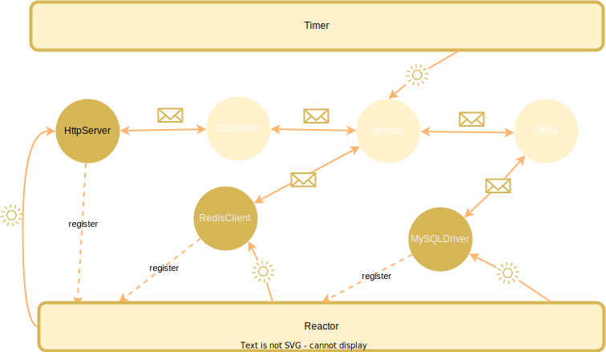
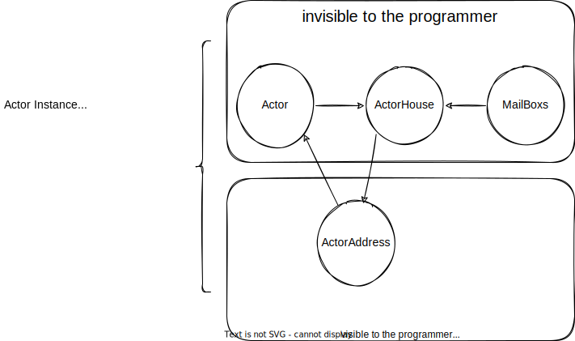

## 现有编程模型的挑战

随着摩尔定律的逐渐失效与现代软件系统规模的疯狂增长，单核 CPU 甚至单机已经不再能满足我们的需求了。为了应对这种挑战，现代软件系统不仅需要在单机上很好地利用多核 CPU，甚至还需要将一个系统分布运行在多台计算机上完成业务。

第一是异步编程，但是面向对象编程范式和异步结合的时候往往导致回调地狱，这种方法破坏了面向对象的封装性，而且也让代码逻辑更加分散。

第二是函数式编程变得更加流行。函数式编程提出了一个美好的愿景：一切都是不可变的！这使得编写代码安全且容易测试。但是函数式编程也有一些缺点：那就是不容易处理状态，而一个现实的软件系统往往需要处理很多状态、IO 等。

与此同时，有一个古老的编程范式似乎更加适合现代这种复杂的高并发分布式的软件系统。那就是 1973 年提出的 Actor 模型。

`otavia` 是基于 `Scala 3` 实现的一个 Actor 编程模型，并且希望探索出一条 Actor 模型与现代编程语言进行更加有效结合的路径。

## otavia 的设计哲学

面向对象编程是一种非常有用的编程范式。但是危机发生在多线程多 CPU 核心之后：多线程就像一群野蛮的公牛一样在脆弱的对象丛林里横冲直撞！你需要仔仔细细关心每一个对象是否会被多个线程同时进入，你需要仔仔细细检查程序的并发安全问题。

值得高兴的是目前已经出现了一些新的技术来解决这些问题。目前主流的技术方案是协程、JVM 虚拟线程。但是在我们看来，这些技术有效地缓解了线程被挂起从而导致 CPU 使用率低的问题，但是并发竞争导致必须仔细设计我们的对象的问题并没有得到缓解。

问题之所以变得如此严重，我们认为主要原因是目前主流编程语言和面向对象编程范式缺失了一些关键特性！即缺乏对并发进行组织，缺乏对执行流的组织！

组织并发和执行流，正是 Actor 模型擅长的领域！而 `Scala 3` 的出现，让我们看到了设计出一种更加贴合面向对象思想的 Actor 编程工具的愿景。于是，在经历了很长一段时间构思之后，我设计了 `otavia` 及其相关工具集。

我们认为一个更合理的编程层级划分体系应该像下面这样，`otavia` 的设计也遵循了这种层级关系：

**系统 > 进程 > 线程 > 虚拟线程/有栈协程 > `Actor > 对象 > 函数`**

在这种层级设计中，Actor 是并发的终点，也就是说，Actor 及其内部的所有逻辑都应该是单线程运行的！Actor 之间通过发送消息进行通信，多条消息会在 Actor 的邮箱中逐条以单线程方式被处理。Actor 内部的逻辑您可以选择面向对象也可以选择函数式，甚至像 `Scala` 一样将两者结合起来！

## 核心运行时

`otavia` 中管理并发的基本单元为 `Actor`。为了满足 IO 编程和定时任务等需求，`otavia` 在 Actor 模型的基础上增加了若干核心组件：

- **Actor**: 并发的基本单元，通过消息进行通信，包含两个基本子类：`StateActor`（业务逻辑）和 `ChannelsActor`（IO 管理）。详见 [Actor 模型](guide/actor_model.md)。
- **ActorSystem**: Actor 实例的容器，负责创建 Actor、管理生命周期和调度执行。详见 [线程模型](guide/threading_model.md)。
- **Message**: 三种基本类型：`Notice`（即发即弃）、`Ask[R <: Reply]`（请求-响应）、`Reply`。通过 `Actor[+M <: Call]` 和 `Address[-M <: Call]` 实现编译时类型安全。详见 [消息模型](guide/message_model.md)。
- **Stack**: Actor 中管理消息执行的载体。使用 `StackState` 和 `Future/Promise` 链的状态机来处理异步消息流，无需回调。详见 [Stack 执行模型](guide/stack_model.md)。
- **Address**: Actor 之间相互隔离，只能通过 `Address` 通信。`PhysicalAddress` 直接路由到 Actor 邮箱；`RobinAddress` 提供轮询负载均衡和线程亲和。详见 [Address 模型](guide/address_model.md)。
- **Channel**: 代表一个 IO 对象（文件、网络连接等），从 Netty 移植而来。使用 `ChannelPipeline` 进行字节级处理，`Inflight` 机制支持请求-响应多路复用。详见 [Channel Pipeline](guide/channel_pipeline.md) 和 [IO 模型](guide/io_model.md)。
- **Reactor**: 每个 `ActorThread` 内的 IO 执行层。每个线程拥有一个 `IoHandler`（如封装 NIO `Selector` 的 `NioHandler`），执行 NIO select、读写。通过 SPI 可插拔。详见 [Reactor 模型](guide/reactor_model.md)。
- **Timer**: 使用 `HashedWheelTimer` 生成超时事件，支持 Actor 超时、Channel 超时、Ask 超时和资源超时。
- **IoC**: 使用 Scala 3 匹配类型实现的编译时类型安全的 Actor 地址依赖注入。详见 [Actor IoC](guide/ioc.md)。

使用 `otavia` 编程，用户必须先启动一个 `ActorSystem` 实例。`ActorSystem` 包含一组 `ActorThread`，每个线程拥有自己的 `IoHandler` 和 `Timer` 组件。接下来用户只需要使用 `ActorSystem` 启动自己的 `Actor` 实例，`ActorSystem` 会返回对应 `Actor` 实例的 `Address`。与面向对象编程中的方法调用不同，发送消息并不会直接执行处理消息的逻辑，而是将消息放入 `Actor` 的邮箱中等待处理。

## 生态系统

`otavia` 除了核心的运行时之外，还包含了一套丰富的生态模块。详情请访问 [otavia 生态](https://github.com/otavia-projects)：

- **CPS 变换** ([otavia-async](https://github.com/otavia-projects/otavia-async))：基于 Scala 3 元编程工具实现的 `async/await` 语法。
- **Buffer**: 从 Netty 移植的高性能 buffer 管理，引入 `AdaptiveBuffer` 替代 `CompositeBuffer`。
- **Codec**: 常用 `ChannelHandler` 抽象类（`Byte2ByteXXcoder`、`Byte2MessageDecoder`、`Message2ByteEncoder`、`Message2MessageXXcoder`）。
- **Serde**: 统一的序列化/反序列化框架，直接与 `Buffer` 协作实现零拷贝性能。详见 [Serde 框架](guide/serde.md)。
- **SQL**: Actor 访问关系型数据库的标准，参考了 JDBC 的设计。
- **SLF4A**: 参考 SLF4J 设计的异步日志框架。详见 [SLF4A](guide/slf4a.md)。
- **Testkit**: 用于测试 Actor 的工具集。
