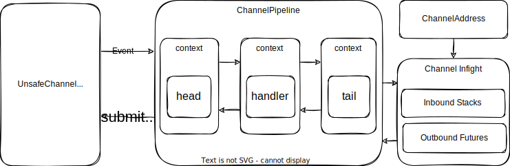
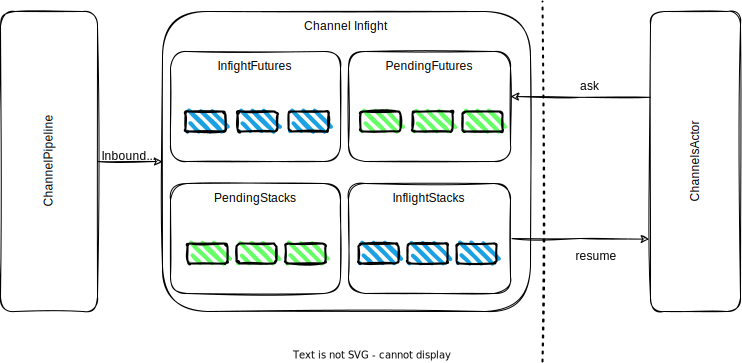

# IO 模型

otavia 的 IO 模型是一个分层的、与 actor 集成的 IO 框架，受 Netty 启发并围绕 Actor 模型重新设计。每个 `ActorThread` 拥有自己的 `IoHandler`（带有专用的 NIO `Selector`），以时间片循环运行 IO 和 actor 逻辑。



## 架构分层

```
Java NIO (Selector / SelectionKey)
    │
NioHandler (IoHandler ── 每个 ActorThread 拥有)
    │
Channel Transport (AbstractNioUnsafeChannel, NioUnsafeSocketChannel 等)
    │
Channel Pipeline (ChannelPipelineImpl ── 双向链表 handler 链)
    │
AbstractChannel (inflight 管理 + barrier 机制)
    │
ChannelsActor (处理来自 Inflight 系统的解码消息)
```

## Channel Inflight

`AbstractChannel` 通过四个 `QueueMap` 实例管理消息并发：

```scala
// 出站 (Actor → Channel → 网络)
inflightFutures: QueueMap[ChannelPromise]  // 正在被 IO 层处理
pendingFutures:  QueueMap[ChannelPromise]  // 等待发送

// 入站 (网络 → Channel → Actor)
inflightStacks: QueueMap[ChannelStack[?]]  // 正在被 Actor 处理
pendingStacks:  QueueMap[ChannelStack[?]]  // 等待 Actor 处理
```

`QueueMap` 是自定义数据结构，结合了哈希表（按实体 ID 的 O(1) 查找，用于响应关联）和双向队列（FIFO 顺序，用于顺序处理）。



### Barrier 流控

两个 barrier 函数控制消息流：

- **`futureBarrier: AnyRef => Boolean`**（默认 `_ => false`）：控制**出站**流。检测到 barrier 消息时，一次只能有一个 future 在处理中。
- **`stackBarrier: AnyRef => Boolean`**（默认 `_ => true`）：控制**入站**流。为 true（默认）时，消息逐条顺序处理。

通过 `ChannelOption` 配置：

| 选项 | 说明 | 默认值 |
|------|------|--------|
| `CHANNEL_FUTURE_BARRIER` | 出站 barrier 谓词 | `_ => false` |
| `CHANNEL_STACK_BARRIER` | 入站 barrier 谓词 | `_ => true` |
| `CHANNEL_MAX_FUTURE_INFLIGHT` | 最大并发出站 future | 1 |
| `CHANNEL_MAX_STACK_INFLIGHT` | 最大并发入站 stack | 1 |
| `CHANNEL_STACK_HEAD_OF_LINE` | Stack 是否队头阻塞 | false |

## Channel 行为的抽象

### ChannelFuture

`ChannelFuture` 代表 Actor 向 Channel 发送请求并期望获得回复。由 `StackState` 管理，与 Stack 执行模型集成。通过 `ChannelAddress` 使用：

```scala
// 在 ChannelsActor 中，使用 ChannelFutureState：
val state = ChannelFutureState()
channel.ask(myRequest, state.future)
stack.suspend(state)
```

### ChannelStack

`ChannelStack` 代表 Channel 将解码后的消息发送给 Actor 进行业务处理。当 TailHandler 收到入站消息时，创建 `ChannelStack` 通过 Inflight 系统路由到 Actor。

**注意**：与 Netty 的 `ChannelFuture`（追踪单次出站调用的结果）不同，otavia 的 `ChannelFuture` 是比 Netty 更高级的抽象，代表网络请求的期望数据响应。

## 完整 TCP 读生命周期

```
1. Actor 调用 channel.read() → pipeline.read() → HeadHandler.read()
   → channel.readTransport() → ioHandler.read(channel, plan)

2. NioHandler 处理 OP_READ 就绪的 key
   → NioUnsafeSocketChannel.handle(key) → readNow() → readLoop()

3. doReadNow0(): page.transferFrom(ch) 从 socket 读取
   → channel.handleChannelReadBuffer(page)

4. 数据进入 channelInboundAdaptiveBuffer → pipeline.fireChannelRead(buffer)

5. Pipeline 处理：Decoder → ... → TailHandler
   → TailHandler.channelRead → channel.onInboundMessage(msg)

6. onInboundMessage: 创建 ChannelStack → pendingStacks
   → processPendingStacks → executor.receiveChannelMessage(stack)  [进入 actor 邮箱]

7. Actor 线程处理 ChannelsActor → dispatchChannelStack → resumeChannelStack
   → 用户代码处理解码后的消息
```

**核心要点**：原始字节在 `ActorThread` 循环的 Phase 1（IO）阶段通过 pipeline 处理。解码后的消息通过 Inflight 系统进入 Actor 邮箱，在 Phase 2（IO Pipeline）阶段处理。

## 完整 TCP 写生命周期

```
1. Actor 调用 channel.ask(value, future)
   → 创建 ChannelPromise → pendingFutures → 调度处理

2. ActorHouse.run() → processPendingFutures()
   → pendingFutures.pop() → inflightFutures.append(promise)
   → pipeline.writeAndFlush(msg)

3. Pipeline 出站：Encoder → ... → HeadHandler.write()
   → channel.writeTransport(msg) → 写入 channelOutboundAdaptiveBuffer

4. HeadHandler.flush() → channel.flushTransport()
   → ioHandler.flush(channel, payload) → NioUnsafeSocketChannel.unsafeFlush()
   → 写入 SocketChannel，部分写入时启用 OP_WRITE

5. 响应到达：Read → Pipeline → TailHandler → onInboundMessage
   → 解决 inflight future：promise.setSuccess(msg)
   → Actor 的 attached future 完成 → Stack 恢复
```

## 完整 TCP Accept 生命周期

```
1. Server channel 注册 + 绑定 → OP_ACCEPT interest 设置

2. NioHandler.run() → OP_ACCEPT 就绪 → NioUnsafeServerSocketChannel.handle()
   → doReadNow() → javaChannel.accept() → 新 SocketChannel

3. 创建 NioSocketChannel → executorAddress.inform(AcceptedEvent)
   → 事件进入 ChannelsActor 邮箱

4. ChannelsActor 接收 AcceptedEvent → pipeline.fireChannelRead(accepted)
   → 用户 handler 处理新 channel（注册到线程的 ioHandler）
```

## Channel 状态

Channel 状态使用位压缩存储在单个 `Long` 中。22 个生命周期布尔值（created、registered、bound、connected 等）和配置布尔值（autoRead、writable 等）打包到一个 64 位字中。


