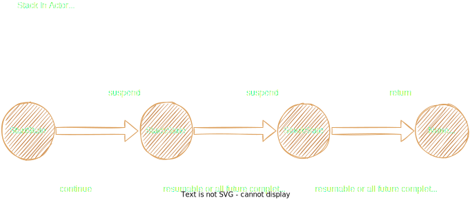

# Stack 执行模型

Stack 是 otavia 最具特色的创新。它取代了传统的回调和协程，使用手动管理的状态机和池化对象。

## 核心概念

### Stack

`Stack` 是管理单条消息处理生命周期的执行帧。它维护两条双向 promise 链：

- **未完成链**（`uncompletedHead/uncompletedTail`）：已发出但尚未收到回复的 Ask 的 promise
- **已完成链**（`completedHead/completedTail`）：已收到回复的 promise

每个 Stack 包含：
- `stackState: StackState` — 状态机中的当前状态
- `nextState: StackState` — 挂起时要转换到的状态
- `actor: AbstractActor` — 所属 actor

### StackState

接口，包含 `resumable(): Boolean` 和 `id: Int`。用户定义的状态实现此接口（通常结合 `Poolable` 用于回收）。`StackState.start` 是单例初始状态，其 `resumable()` 返回 `true`。

### StackYield

密封 trait，两个单例：
- **`SUSPEND`**（`completed = false`）：Stack 被挂起，等待异步操作
- **`RETURN`**（`completed = true`）：Stack 完成，可被回收

### suspend 和 return

```scala
// 挂起：保存下一个状态并返回 SUSPEND
def suspend(state: StackState): StackYield = {
  this.nextState = state
  StackYield.SUSPEND
}

// return：Stack 调用此方法完成
// 对于 NoticeStack：
stack.return()        // 返回 StackYield.RETURN

// 对于 AskStack：
stack.return(reply)   // 发送回复给 sender，返回 StackYield.RETURN
```

## Stack 类型

| 类型 | 用途 | return 方法 |
|------|------|-------------|
| `NoticeStack[N]` | 管理 Notice 执行 | `return()` |
| `AskStack[A]` | 管理 Ask 执行 | `return(reply)` 或 `throw(cause)` |
| `ChannelStack[T]` | 管理 Channel 入站消息 | `return(result)` |
| `BatchNoticeStack[N]` | 批量 Notice 执行 | `return()` |
| `BatchAskStack[A]` | 批量 Ask 执行 | `return(reply)` 或 `return(Seq[(Envelope, Reply)])` |

### AskStack

`AskStack` 跟踪 Ask 消息、发送者 Address 和用于回复关联的 askId：

```scala
// 用户实现：
override protected def resumeAsk(stack: AskStack[MyAsk]): StackYield = {
  stack.state.id match {
    case StartState.id =>
      val state = FutureState[MyReply]()
      target.ask(stack.ask.asInstanceOf[MyAsk], state.future)
      stack.suspend(state)
    case FutureState.id =>
      val reply = stack.state.asInstanceOf[FutureState[MyReply]].future.getNow
      // 处理回复...
      stack.return(MyReply(...))
  }
}
```

### ChannelStack

与其他 Stack 类型不同，`ChannelStack` 同时扩展 `Stack` 和 `QueueMapEntity`，与 Channel 的 inflight `QueueMap` 集成。ChannelStack **不会**被 `switchState` 回收 — 由 Channel 的 inflight 队列管理。

## Future 和 Promise

### 设计理念

`otavia` 实现了自己的 `Future/Promise` 系统，与 Scala 标准库分离。以零内存分配为目标进行设计：

- `MessagePromise[R]` **就是** `MessageFuture[R]` — 同一个对象，无包装分配
- `MessagePromise` **就是** `FutureDispatcher` 中的哈希节点 — 直接拥有 `hashNext`，无包装
- 所有 Promise 通过 `ActorThreadIsolatedObjectPool` 池化

### MessagePromise / MessageFuture

用于 Actor 之间的 Ask/Reply：
- `aid: Long` — 消息 ID（FutureDispatcher 中的哈希键）
- `tid: Long` — 超时注册 ID（用于取消）
- `result: AnyRef` / `error: Throwable` — 完成状态
- `stack: Stack` — 所属 Stack

### ChannelPromise / ChannelFuture

用于 Actor 到 Channel 的请求/响应：
- `ch: Channel` — 关联的 channel
- `ask: AnyRef` — Channel 操作请求
- `callback: ChannelPromise => Unit` — 可选的完成回调

## 辅助 State

### FutureState

`FutureState[R]` 组合 `StackState` 和 `MessageFuture[R]`。这是用户发送 Ask 的标准机制：

```scala
val state = FutureState[MyReply]()
targetAddress.ask(myAsk, state.future)
stack.suspend(state)
// 恢复时：
val reply = state.future.getNow
```

### ChannelFutureState

同模式但包装 `ChannelFuture`，用于异步 channel 操作（bind、connect、register）。

### StartState

单例初始状态。`resumable() = true`，确保第一个 promise 完成时立即触发恢复。

## FutureDispatcher

`FutureDispatcher` 是自定义的基于桶链式冲突解决的哈希表，将 `Long` 消息 ID 映射到 `MessagePromise` 实例。混入 `AbstractActor`。

设计特点：
- `loadFactor = 2.0`（当 `contentSize + 1 >= threshold` 时增长）
- `index(id) = (id & mask).toInt` — 位掩码索引
- 通过 `MessagePromise.hashNext` 链表解决冲突（无包装对象）
- 当表增长到 4 倍初始容量但使用率 < 50% 时自动缩容

## 状态机转换

### switchState（核心转换引擎）

**SUSPEND 路径**：
1. 从 Stack 获取 `oldState`，获取 `nextState`（由 `suspend` 设置）
2. 如果状态改变：设置新状态，回收旧状态（如果是 `Poolable`）
3. 断言 Stack 仍有未完成的 promise

**RETURN 路径**：
1. 回收当前 state
2. 断言 `stack.isDone`
3. 非 `ChannelStack` → 将整个 Stack 回收到对象池

### handlePromiseCompleted（恢复逻辑）

当 Reply 到达并完成 Promise 时：
1. `stack.moveCompletedPromise(promise)` — 从未完成链转移到已完成链
2. 检查：`stack.state.resumable()` 或 `!stack.hasUncompletedPromise`
3. 如果可恢复：重新分发 Stack（如 `dispatchAskStack(stack)`）

## 完整 Ask/Reply 生命周期

### 阶段 1：发送

```
ActorA.ask(myAsk) → 创建 FutureState[Reply]
  → PhysicalAddress.packaging → 从池获取 Envelope
  → sender.attachStack(messageId, future):
      promise.stack = currentStack
      promise.id = messageId
      currentStack.addUncompletedPromise(promise)
      FutureDispatcher.push(promise)
  → houseB.putAsk(envelope)
```

### 阶段 2：处理

```
ActorHouseB.run() → dispatchAsks()
  → receiveAsk → 从池获取 AskStack → setAsk → dispatchAskStack
  → resumeAsk(stack) 执行用户代码
  → stack.return(reply):
      sender.reply(reply, askId) → reply Envelope → houseA.putReply()
```

### 阶段 3：恢复

```
ActorHouseA.run() → dispatchReplies()（最高优先级！）
  → receiveReply → 提取 reply + replyId
  → FutureDispatcher.pop(replyId) → MessagePromise
  → promise.setSuccess(reply)
  → handlePromiseCompleted(stack, promise):
      moveCompletedPromise（未完成 → 已完成）
      state.resumable() == true
      → dispatchAskStack(stack)（重新分发！）
  → resumeAsk 以新状态再次执行
  → state.future.getNow → 处理回复 → stack.return(finalReply)
```



## 对象池化

池化策略是积极且多层次的，旨在实现零 GC 操作：

1. **线程隔离池**：每个池化类型都有自己的 `ActorThreadIsolatedObjectPool`，每个线程一个 `SingleThreadPoolableHolder`
2. **创建者亲和**：在非创建者线程上回收的对象直接丢弃（由 GC 回收），避免跨线程池同步
3. **空闲清理**：60 秒超时触发，将 30 秒未访问的池缩减到最多 10 个对象
4. **Stack 级生命周期**：完成的 promise 在 `setState` 时回收。整个 Stack 通过 `recycleStack` 回收
5. **Envelope 即用即收**：Envelope 在提取数据后立即回收，不持有到 Stack 生命周期结束
6. **无包装对象**：`MessagePromise` = `MessageFuture` = 哈希节点（三合一）
