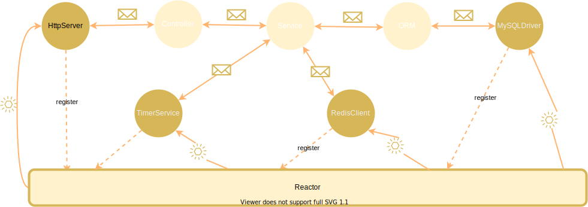

# otavia

一个先进的 IO 和 Actor 编程模型。

## 编程模型

`otavia` 对于用户编程来说，有以下主要概念

- `ActorBase`: 资源与代码执行的基本单元，`ActorBase` 实例之间的不能直接访问对方资源，只能通过 `Message`
  进行通信，其有两个基本子类 `Actor` 和 `ChannelGroup`。
- `Actor`: 基本执行单元，负责接收消息和发送消息，用户需要根据自己的业务逻辑实现自己的 `Actor`。
- `ChannelGroup`: 基本执行单元，并且管理一组 `socket` 的生命周期，负责将接收到的消息编码传输给
  对应 `socket` 及从 `socket` 读取数据解码出消息然后发送给其他 `ActorBase` 实例。其可以向 `Eventor`
  注册 `socket` 关心的 IO 事件和定时事件。注册的事件到达条件时 `Eventor` 发送 `Event` 事件，
  `ChannelGroup` 除了处理消息之外，还要处理 `Eventor` 发送来的 `Event` 事件。
- `Address`: `ActorBase` 实例的消息发送客户端，`ActorBase` 内部不能直接访问其他 `ActorBase` 实例，
  但是可以通过 `Address` 给其代表的 `ActorBase` 实例或实例集合发送消息。
- `Eventor`: 事件监听器，监视注册的 `socket` 事件和定时事件，并产生 `Event` 然后发送给相关的
  `ChannelGroup` 实例。
- `Message`: 消息，`ActorBase` 实例之间通信的基本单位，不可变。
- `Event`: `socket` 的 IO 就绪事件和定时事件。
- `ActorSystem`: `ActorBase` 实例容器，负责创建`ActorBase` 实例、管理 `ActorBase` 实例的生命周期，
  和调度 `ActorBase` 实例的执行。

`otavia` 是 Actor 模型的一种变体形式，其 `ActorBase` 代表传统意义上的 Actor，与一般 Actor 模型（比如 AKKA）
的实现所不同的是，`otavia` 为了更好的处理现代网络程序高 IO 并发的需求，单独抽象出了 `ChannelGroup` 的概念，
`ChannelGroup` 负责管理一个 `socket` 集合，由用户具体实现协议的编解码工作，并且 `socket` 的状态由统一的
`Eventor` 进行监听，对于状态发生变更的 `socket`, `Eventor` 向对应的 `ChannelGroup` 发送 `Event` 事件
进行通知，

### ActorBase

`ActorBase` 实例是 `otavia` 的基本执行单位、资源的基本管理单位, `ActorBase` 实例可以通过 `Address`
向其他 `ActorBase` 实例发送消息，并且发送消息的行为是非阻塞的，发送的消息会临时保存到 `ActorBase` 内部的
消息邮箱中，`ActorSystem` 会调度消息邮箱中存在消息的 `ActorBase` 实例，给他分配CPU资源进行消息的处理。

消息如何发送到消息邮箱和 `ActorSystem` 如何调度 `ActorBase` 实例执行对用户而言是不可见的，用户不需要了解
这些底层机制，只需要编写发送消息和处理消息的代码，在用户看来就是一个 `ActorBase` 实例执行中通过 `Address`
向其他的 `ActorBase` 实例发送消息，其他 `ActorBase` 实例处理对应的消息。

`ActorBase` 抽象类有两类基本子类

- `Actor`
- `ChannelGroup`

> 以下文档中若无特殊区分， Actor 指 Actor 和 ChannelGroup

### Actor

### ChannelGroup

### Address 地址系统

地址是 `Actor` 之间通信的关键，由于 `Actor` 实例相互之间的隔离性，他们之间的通信必须依靠代表 `Actor` 的地址
进行。 Actor 的地址分为物理地址和虚拟地址。

- 物理地址（`PhysicalAddress`）: 每个 Actor 实例对应一个唯一的地址对象，在 Actor 创建的时候创建，通过这个地址
  发送的消息只会传输给其对应的 Actor。
- 代理地址：基于物理地址衍生的地址，其实例内部一般包含一个或多个物理地址，通过特殊定义的规则将消息转发到物理地址，一般
  在需要的时候创建。框架使用者也可以通过继承 `` 定义自己的代理地址类。

> 以后文档中说 Actor 给 Actor 发送消息，指 Actor 通过另外的 Actor 的地址发送消息。

### 消息模型

消息是 `otavia` 中通信的基本载体，其具有不可变的特性。 `otavia` 中发送消息都是非阻塞的， Actor 通过地址发送消息
不会阻塞 Actor。

消息类型具体分为 `Message` `AskMessage` `ReplyMessage`, 其中 `AskMessage` `ReplyMessage` 为 `Message`
的子 trait。 消息使用 scala 中 case class 定义， 且必须继承以上3个 trait 的任一一个。 每个消息在创建时会自动生产
一些额外的信息，这些额外的信息用于定位消息的发送者、消息的序列号等信息。

- `Message`: 消息的基本 trait
- `AskMessage`: 期待获取一个 `ReplyMessage` 回复消息的消息。
- `ReplyMessage`: 回复消息，当 Actor 收到 `AskMessage` 消息时，需要回复一个 `ReplyMessage` 消息。

由于 `otavia` 设计为全异步编程模型，发送消息之后不会阻塞 Actor，发送方法也不会返回任何值，所以即使发送了
`AskMessage` 消息，当前执行流也不会立即获取到 `ReplyMessage`，`ReplyMessage` 消息仍然会通过统一的消息
入口重新进入 Actor 执行流。为了识别 `ReplyMessage` 与 `AskMessage` 的对应关系，`ReplyMessage` 包含了
回复的 `AskMessage` 消息的消息序列号。

为了更好的实现该消息模型，Actor 中定义了以下相关概念

- `ActorFuture`:
- `ActorPromise`:
- `ActorStack`:

### 批量处理

批量处理赋予 Actor 批量处理消息和一个 `ReplyMessage` 回复多个 `AskMessage` 的能力。这在一些场景中能大幅降低系统
的开销。

### 依赖注入

定义 `Actor` 或 `ChannelGroup` 时，继承 `io.otavia.core.ioc.Injectable` trait， 其提供了方法
查找注册在 `ActorSystem` 中的全局 `ActorBase` 实例，并且返回地址。

## 生态

### ADBC (Actor Database Connect) 规范

### HTTP

### SSL/TSL

### WebSocket

### Logger

## 底层实现原理

## 思考特性

